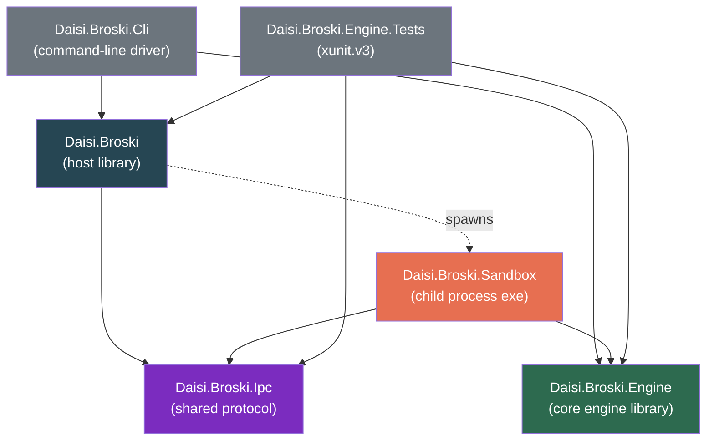

# Architecture

> System design for daisi-broski — a native C# headless web browser engine with no third-party dependencies.
> [Roadmap](roadmap.md) · [Design decisions](design-decisions.md)

> **This document describes the full target architecture**, including subsystems that are not yet implemented (JavaScript engine, CSS cascade, layout, most Web APIs). For the current shipped state — which projects exist, which subsystems work against real sites today, and what's deferred — read [roadmap.md](roadmap.md). Section headings below whose subsystem is already on `dev` are marked ✅; unmarked sections are still aspirational.

---

## 1. Elevator pitch

daisi-broski is a browser engine implemented entirely in C# against the .NET 10 Base Class Library. It takes a URL, fetches it over HTTP/HTTPS, parses the HTML5 response into a DOM, parses stylesheets into a CSSOM, executes JavaScript against the DOM inside our own interpreter, and exposes the resulting state to a host application — all inside a sandboxed child process with kernel-enforced memory and resource limits.

We deliberately scope out visual rendering (layout, paint, fonts, compositing) in early phases. Most "browsing" tasks that embedders actually want — scraping, automation, testing, AI agents, preview generation — need a working DOM and a working JavaScript engine, not a pixel buffer. Adding layout later is a well-isolated additive phase; it does not change the core engine.

## 2. Constraints and what they imply

| Constraint | Implication |
|---|---|
| **Native C# only** | No C/C++ interop to V8, SpiderMonkey, or Blink. The JS engine, HTML parser, and CSS engine are all written in C#. |
| **No third-party libraries** | Parsers, interpreters, compression (beyond `System.IO.Compression`), and decoders are hand-written. `HttpClient`, `SslStream`, `System.Net.WebSockets`, `System.Text.Json`, `System.IO.Pipes`, `System.Security.Cryptography` are BCL and therefore allowed. |
| **Sandboxed memory space** | The engine runs in a *child process* bounded by a Win32 Job Object. The host process never executes untrusted parser, DOM, or JS code in its own address space. |
| **Works with most websites** | Target modern JS-heavy SPAs. The bar is "loads initial content and responds to scripted interaction," not pixel parity with Chromium. |
| **No external dependencies** | No downloads at build time, no native binaries (beyond what Windows already ships), no package feeds. `dotnet build` on a clean machine should produce a working binary. |

The "no third-party" rule is the hardest constraint because it rules out every existing HTML parser and JS engine in the .NET ecosystem. We are writing those.

## 3. Process model

```
┌─────────────────────────────┐           ┌─────────────────────────────┐
│ Host process                │           │ Sandbox child process        │
│  (Daisi.Broski.Cli, or any   │  named    │  (Daisi.Broski.Sandbox.exe)  │
│   consumer application)      │  pipe     │                              │
│                              │ ◄───────► │  ┌────────────────────────┐ │
│  Daisi.Broski.Host            │  IPC      │  │ Daisi.Broski.Engine    │ │
│  ┌────────────────────┐      │           │  │  - Network (HttpClient)│ │
│  │ BrowserSession     │      │           │  │  - HTML5 parser        │ │
│  │  - spawn()         │      │           │  │  - CSS parser          │ │
│  │  - navigate()      │      │           │  │  - DOM                 │ │
│  │  - evaluate()      │      │           │  │  - JS interpreter      │ │
│  │  - dispose()       │      │           │  │  - Web APIs            │ │
│  └────────────────────┘      │           │  └────────────────────────┘ │
│                              │           │                              │
│  Win32 Job Object ──────────────────────► enforces memory cap, kills    │
│  (kernel-enforced)           │           │  child on host exit, blocks  │
│                              │           │  UI, etc.                    │
└─────────────────────────────┘           └─────────────────────────────┘
```

**Why a separate process?** Three reasons:

1. **True memory isolation.** .NET's `AppDomain` is deprecated; `AssemblyLoadContext` provides assembly isolation but not a security boundary — unsafe code, P/Invoke, and unbounded allocations can still take down the host. Only an OS process boundary gives you kernel-enforced memory limits and crash containment.
2. **Resource caps.** Job Objects let us set a hard `ProcessMemoryLimit` (e.g. 256 MiB). If the JS engine runs away or a site tries to blow up the parser, the kernel kills the child — not our host.
3. **Kill-on-host-exit.** With `JOB_OBJECT_LIMIT_KILL_ON_JOB_CLOSE`, closing the host process automatically terminates every sandbox child. No stragglers, no leaks.

**Why one child per session (not per origin)?** Initial implementation: one child per `BrowserSession`. This keeps IPC simple and matches most use cases (one script = one tab). A per-origin process-per-site model is a later optimization; the IPC protocol and sandbox launcher already support it trivially by spawning multiple children.

## 4. Solution layout ✅



| Project | Role |
|---|---|
| **Daisi.Broski** | Public host-side API: `BrowserSession`, `SandboxLauncher`, `SandboxProcess`, `JobObject`. Responsible for spawning the sandbox child, setting up the Job Object via Win32 P/Invoke, and running the IPC client over anonymous pipes. No parsing, no JS — pure host. Windows-only. |
| **Daisi.Broski.Engine** | The core engine library. Phase 1 subsystems shipped: `Net.HttpFetcher`, `Html.EncodingSniffer` / `Tokenizer` / `HtmlTreeBuilder` / `HtmlEntities`, `Dom.{Node, Element, Document, Text, Comment, DocumentType}`, `Dom.Selectors.{SelectorParser, SelectorMatcher}`, `PageLoader` (end-to-end glue). The CSSOM cascade, JavaScript interpreter, and most Web APIs are phase 2–3 additions. Does not know about processes or IPC — can be unit-tested directly in-process. |
| **Daisi.Broski.Ipc** | Shared protocol library. `IpcMessage` envelope (Request / Response / Notification), `IpcCodec` (length-prefixed UTF-8 JSON framing over any `Stream`, 64 MiB cap), phase-1 DTOs (`NavigateRequest` / `NavigateResponse`, `QueryAllRequest` / `QueryAllResponse`, `SerializedElement`, `CloseRequest` / `CloseResponse`). No dependency on the engine or Win32, so it can grow without touching either boundary. |
| **Daisi.Broski.Sandbox** | A console `.exe` whose `Main` parses `--in-handle` / `--out-handle`, opens the inherited `AnonymousPipeClientStream`s, and hands off to `SandboxRuntime` — a single-threaded dispatch loop that reads IPC frames and drives a long-lived `PageLoader`. AppContainer SID application is planned for phase 5; today the sandbox runs with the parent's token inside the Job Object's limits. |
| **Daisi.Broski.Cli** | Command-line driver that wraps `Daisi.Broski` for manual use: `daisi-broski fetch <url> [--select <css>] [--html] [--ua <s>] [--max-redirects N] [--no-sandbox]`. Defaults to sandboxed execution on Windows; `--no-sandbox` falls back to in-process `PageLoader`. An `eval` command for scripted pages will land with phase 3. |
| **Daisi.Broski.Engine.Tests** | xunit.v3 test project. Fast unit tests run against `Daisi.Broski.Engine` directly (network, html, dom, selectors, page loader). Integration tests spawn real sandbox and CLI child processes against a local `HttpListener` fixture. Combined: 180/180 passing. |

`Daisi.Broski.Engine` has no dependency on `Daisi.Broski`, `Daisi.Broski.Ipc`, or `Daisi.Broski.Sandbox` — it's a pure library. This is what lets us test the engine in-process without touching the sandbox at all.

## 5. Subsystem-by-subsystem

### 5.1 Networking ✅ (core subset)

`Daisi.Broski.Engine.Net.HttpFetcher` is a thin facade over `HttpClient` + `SocketsHttpHandler`. What ships today:

- **Cookie jar** — per-session `CookieContainer` carried on `HttpFetcherOptions`. No custom `Set-Cookie` prefilter — we rely on BCL behavior, which is good enough for modern sites. Problematic cookie edge cases (`SameSite=None` without `Secure`) will get a prefilter only if real sites trip over them.
- **Redirect policy** — manual redirect handling so the `FetchResult.RedirectChain` exposes the full hop list and the cap is enforced in one place. `AllowAutoRedirect = false` on the underlying `SocketsHttpHandler`.
- **Decompression** — `HttpClient` handles gzip / deflate; Brotli via the BCL handler. Zstd skipped (not yet standard).
- **HTTP/2** — `HttpClient` supports it natively on .NET 10. HTTP/3 is opt-in and will be enabled when sites require it.
- **Response size cap** — streamed enforcement (`HttpFetcherOptions.MaxResponseBytes`, default 50 MiB). `Content-Length` is checked upfront when present; we also enforce the cap while streaming because `Content-Length` can lie or be chunked.
- **Default Chromium User-Agent** — overridable. Many sites gate features on UA sniffing.

**Not yet shipped** — planned additions to `Net` as phase 3 / 5 land:

- `IRequestInterceptor` hook for blocking / rewriting / recording (needed for the sandbox's network allowlist and for test scaffolding).
- `IDnsResolver` hook so the sandbox can enforce a DNS allowlist without the engine knowing.
- `System.Net.WebSockets.ClientWebSocket` wrapped as the DOM's `WebSocket` Web API (phase 5).

No third-party HTTP client. No custom TLS. `SslStream` underneath is fine.

### 5.2 HTML5 parser ✅ (phase-1 subset)

The target is a spec-compliant WHATWG HTML5 tokenizer + tree builder. What ships today is a **pragmatic phase-1 subset** that handles the shapes real documents are made of; edge cases defer until phase 3 or later uncovers a real site that trips over them.

**What's built:**

- `Daisi.Broski.Engine.Html.EncodingSniffer` — BOM → `Content-Type` charset → `<meta>` prescan of the first 1024 bytes → UTF-8 fallback.
- `Daisi.Broski.Engine.Html.Tokenizer` — class-based state machine over `string` input, producing `HtmlToken`s (`StartTagToken`, `EndTagToken`, `CharacterToken`, `CommentToken`, `DoctypeToken`, `EndOfFileToken`). 22 states implemented: data, tag open / end tag open / tag name, all three attribute value forms, self-closing, comment start / comment / comment-end-dash / comment-end, doctype start / before-doctype-name / doctype-name / after-doctype-name, and the RAWTEXT / RCDATA / ScriptData special states for `<script>`, `<style>`, `<title>`, `<textarea>`, `<iframe>`, `<noscript>`, `<noembed>`, `<noframes>`, `<xmp>`. Character data in the data state is batched into single `CharacterToken` runs rather than one token per character.
- `Daisi.Broski.Engine.Html.HtmlEntities` — hand-curated table of ~120 named entities (structural, Latin-1 supplement, typographic, currency, math, arrows, Greek letters, shapes) plus decimal / hex numeric references, WHATWG Windows-1252 fixup for code points 0x80–0x9F, and U+FFFD substitution for surrogates / out-of-range code points.
- `Daisi.Broski.Engine.Html.HtmlTreeBuilder` — the insertion-mode state machine: Initial → BeforeHtml → BeforeHead → InHead → AfterHead → InBody → Text → AfterBody → AfterAfterBody. Handles implicit html / head / body synthesis, implicit `<p>` close on block-level elements, implicit close of same-named list / row / option / dd / dt, void elements, character-run merging into single `Text` nodes, and a simplified "pop until matching name" adoption for misnested end tags.

Input is passed as a `string` rather than a `ReadOnlySpan<char>` because the tokenizer is a class with state buffers (`StringBuilder`) — span-over-input simplicity loses to type-safety here, and phase 1 isn't allocation-sensitive enough to need zero-copy tokenization. Phase 7 (performance) may revisit.

**Deferred to future phases** (all documented in the relevant class comments):

- **Tokenizer:** CDATA sections, DOCTYPE public/system identifiers, full script-data escape sub-states (legacy HTML3/IE compat), legacy no-semicolon named entities.
- **Tree builder:** table insertion modes (table tags parse as regular elements today — wrong for malformed tables, works for well-formed ones), form element association, template elements, SVG/MathML foreign content, frameset, quirks mode, full adoption agency algorithm (misnested tag patterns like `<b><i></b></i>` give a different tree than Chrome).
- **Test vectors:** the [html5lib-tests](https://github.com/html5lib/html5lib-tests) `.dat` vector suites (CC0, not a library) are not yet vendored. Phase 1 ships with ~100 hand-written xUnit tests covering the same surface, sufficient for the ship-gate demo but not an objective measure of spec conformance.
- **`<script>`-triggered `document.write` reentry** — treated as async once JS lands. Full SVG/MathML DOM. Pretty-printing on serialization.

See [html-parser.md](html-parser.md) (planned) for the detailed design when it's written.

### 5.3 CSS parser, selectors, cascade — partial ✅

We need enough CSS for JavaScript to query computed styles and for `querySelector(All)` to work. We do **not** need layout in phase 1.

**What ships today (phase 1):**

- `Daisi.Broski.Engine.Dom.Selectors.SelectorParser` — CSS selector source → `SelectorList` AST. Covers type / universal / id / class / attribute (all 7 match operators plus the `i` case-insensitive flag), compound, all four combinators, selector lists, and the common pseudo-classes: `:first-child`, `:last-child`, `:only-child`, `:first-of-type`, `:last-of-type`, `:only-of-type`, `:nth-*(An+B)` with odd/even keywords, `:root`, `:empty`, `:not`. Rejects pseudo-elements, `:has`/`:is`/`:where`, `:hover`/`:focus`, and namespace prefixes with a clear `SelectorParseException`.
- `Daisi.Broski.Engine.Dom.Selectors.SelectorMatcher` — right-to-left matching algorithm. Wired onto `Node.QuerySelector` / `Node.QuerySelectorAll` (on any subtree root) and `Element.Matches` / `Element.Closest`.

**Planned for phase 2** (see [roadmap.md](roadmap.md)):

- `Daisi.Broski.Engine.Css.Tokenizer` — CSS Syntax Level 3 tokenizer.
- `Daisi.Broski.Engine.Css.Parser` — produces a `Stylesheet` of `Rule`s, each a `Selector[]` and a `Declaration[]`.
- `Daisi.Broski.Engine.Css.Cascade` — resolves computed values per element: specificity, `!important`, inheritance, `var()`, `calc()`, media queries.
- Style recalculation triggered on DOM mutation with a dirty-node set.
- `element.style`, `getComputedStyle` returning declared values. Layout-dependent values (`getBoundingClientRect`, offsets, etc.) keep returning stubs — see §8.

Phase 1 explicitly ships selectors without the cascade because selectors are immediately useful (for the `daisi-broski fetch --select` ship-gate demo, and for any scraping consumer), while the cascade is plumbing that doesn't pay off until phase 3 is in.

### 5.4 DOM — partial ✅

`Daisi.Broski.Engine.Dom` implements the core of DOM Level 4 needed by the phase-1 parser and selector engine. Script-facing extensions land with phase 3.

**What ships today (phase 1):**

- `Node`, `Element`, `Document`, `Text`, `Comment`, `DocumentType` — plain C# class hierarchy with `NodeType`, `NodeName`, `OwnerDocument`, `ParentNode`, `PreviousSibling` / `NextSibling`, `ChildNodes` (indexable `IReadOnlyList<Node>`), `FirstChild` / `LastChild` / `HasChildNodes`, `TextContent`.
- Mutations: `AppendChild`, `InsertBefore`, `RemoveChild`, `Contains`. `AppendChild` auto-detaches the child from its previous parent (matching DOM semantics) and refuses to create a cycle via a contains-check. Subtree adoption propagates `OwnerDocument` through every descendant on attach.
- `Element`: `TagName` (lowercase), `Attributes` (ordered `List<KeyValuePair<string, string>>`), `GetAttribute` / `SetAttribute` / `HasAttribute` / `RemoveAttribute`, `Id`, `ClassName`, `ClassList`, `Children`, `FirstElementChild`.
- `Document`: `DocumentElement`, `Head`, `Body`, `Doctype`, factory methods (`CreateElement` / `CreateTextNode` / `CreateComment` / `CreateDocumentType`), `GetElementById`, `GetElementsByTagName`, `GetElementsByClassName`.
- Selector API (§5.3): `QuerySelector`, `QuerySelectorAll`, `Matches`, `Closest`.

**Deferred to phase 3 (or phase 3c's JS DOM bridge specifically):**

- A proper `Attr` node type. Attributes are currently a `List<KeyValuePair<string, string>>` — order-preserving, small, and duplicate-rejected upstream in the tokenizer. When phase 3c wires up the JS `element.attributes` collection, the list becomes a live `NamedNodeMap` backed by real `Attr` nodes.
- `DocumentFragment` — needed for `<template>` and for detached subtree construction.
- Tag-specific element interfaces: `HTMLElement`, `HTMLInputElement`, `HTMLFormElement`, `HTMLImageElement`, etc. Currently all elements are the same `Element` class regardless of tag name. JS code that does `el instanceof HTMLInputElement` will need these.
- `EventTarget`, `addEventListener`, `removeEventListener`, `dispatchEvent`, capture/bubble, `CustomEvent`. No event dispatch today — phase 2 adds the C# side, phase 3c wires it up to scripts.
- Live `NodeList` and `HTMLCollection`. Current collections are static snapshots (`IReadOnlyList<Node>`, returned arrays from `GetElementsByTagName`).
- `MutationObserver` with microtask-queued notifications. Phase 5.
- Shadow DOM. Phase 5+.

**Critical design call:** the DOM is *not* a JS object. It's a plain C# object graph. The JS engine (arriving in phase 3) will expose it via "host objects" — proxy-like wrappers that route property access and method calls back into the C# DOM. This means the DOM can be tested, serialized, and mutated without booting the JS engine (which is exactly how phase 1 uses it), and the JS engine has no special knowledge of "this is an HTMLElement." The separation is already concrete today: every `Daisi.Broski.Engine.Dom.*` test runs without any JS engine present, because there is no JS engine yet.

### 5.5 JavaScript engine — the hardest part (phase 3a in progress)

This is where the most engineering effort goes. We are not going to write a performance-competitive V8. We are going to write a **correctness-first, pragmatic-subset** JavaScript engine that runs the JS real sites actually ship.

**Architecture:**

```
Source text
  │
  ▼
Lexer ──► Token stream          ✅ Daisi.Broski.Engine.Js.JsLexer
             │
             ▼
          Parser ──► AST (ESTree-shaped) ✅ Daisi.Broski.Engine.Js.JsParser
                       │
                       ▼
                   Bytecode compiler ──► Bytecode (stack VM) ✅ Daisi.Broski.Engine.Js.JsCompiler
                                              │
                                              ▼
                                     Interpreter (stack machine) ✅ Daisi.Broski.Engine.Js.JsVM
                                              │
                                              ▼
                                        Heap + Realm + Built-ins
```

**Shipped so far (phase 3a complete; phase 3b in progress, slices 3b-1 through 3b-11 shipped):**

- **`JsLexer`** — scans ES5 source into a stream of `JsToken`s. Recognizes all ES5 keywords plus the ES2015+ future-reserved keywords, ASCII identifiers, decimal / scientific / hex number literals, single- and double-quoted string literals with standard escapes (`\n`, `\t`, `\r`, `\b`, `\f`, `\v`, `\0`, `\x`, `\u`, line continuations), line and block comments (skipped), and every ES5 punctuator including greedy long matches (`>>>=`, `===`, `!==`). Regex literals, template literals, BigInt literals, and Unicode identifiers are deferred. 43 tests.
- **`JsParser` + `Ast`** — recursive-descent parser with precedence climbing for binary operators. Produces an ESTree-shaped sealed-class tree (`Program`, `Expression`, `Statement`, and ~45 concrete node types). Covers every ES5 statement form (`var`/`function`/`if`/`while`/`do..while`/C-style `for`/`for..in`/`break`/`continue`/`return`/`throw`/`try`/`catch`/`finally`/`switch` with fall-through/`with`/`debugger`/labeled/block/empty/expression) and every ES5 expression form (literals, identifiers, `this`, member / computed-member / call / `new`, unary + prefix / postfix update, the full binary operator table with correct precedence and left-associativity, right-associative assignment and ternary, array literals with holes and trailing commas, object literals with reserved-word keys and `get`/`set` accessors, named and anonymous function expressions, sequence expressions). Handles automatic semicolon insertion including restricted productions (`return`/`throw`/`break`/`continue`, postfix `++`/`--`) and the `for..in` / `in`-operator ambiguity via a threaded `allowIn` flag. `let`/`const` are tagged for future block scoping; other ES2015+ forms are rejected with a descriptive `JsParseException` carrying the source offset. Regex literals are still deferred pending the `ReLex` entry point the parser will grow in phase 3c. 69 tests.
- **`JsCompiler` + `JsVM` + `JsEngine` (slice 3 — primitives + global control flow)** — bytecode compiler walking the AST into a `Chunk` of single-byte opcodes, stack-based interpreter dispatching over them, and a thin `Evaluate(source)` facade that returns the completion value of the last top-level expression per ECMA §14. Scope covers: primitive literals; `var` with proper hoisting; assignment and compound assignment to identifier targets; every unary / binary / logical / conditional / sequence / update operator; `typeof` (with spec-mandated special case for undeclared identifiers); `if`/`else`, `while`, `do..while`, C-style `for`, unlabeled `break` / `continue`; `delete` on identifiers; full ES5 coercion model (`ToNumber` / `ToBoolean` / `ToString` / `TypeOf`) and `ToInt32` / `ToUint32` for bitwise and shift ops. Values are boxed .NET objects (DD-05 option A). Short-circuit `&&` / `||` use dedicated `JumpIfFalseKeep` / `JumpIfTrueKeep` opcodes so the winning operand's value (not a coerced boolean) is the result. 52 end-to-end tests.
- **`JsObject` + `JsArray` + member access (slice 4a)** — `JsObject` is a prototype-aware property bag with virtual `Get` / `Set` / `Has` / `Delete`; `JsArray` subclasses it with dense `List<object?>` integer-indexed storage, a virtual `length` property that truncates / extends on write, and a `Join` helper for string coercion (`Array.prototype.toString` delegates to `join(',')` per spec). The compiler emits `CreateObject` / `CreateArray` / `InitProperty` / `GetProperty`(Computed) / `SetProperty`(Computed) / `DeleteProperty`(Computed) / `In` / `Dup2` / `StoreScratch` / `LoadScratch` for object and array literals, dot and computed member access, assignment and compound assignment to members, prefix and postfix update on member targets (both dotted and computed), `delete` on members, and the `in` operator. Object literal keys are normalized to strings during compilation. The single-slot VM `_scratch` register handles the "save old value" part of postfix update on a member target. 38 end-to-end tests.
- **Functions + closures + `this` + `new` + `instanceof` (slice 4b)** — `JsEnvironment` (Dictionary-backed binding record with a parent reference) replaces the single globals dictionary as the name-resolution mechanism. `LoadGlobal` and friends now walk the env chain; at the top level the chain has one env (the globals env), so existing behavior is preserved. `JsFunctionTemplate` is the immutable compiled form of a function (chunk + param names); `JsFunction` subclasses `JsObject` to carry a template plus a captured env reference plus an auto-initialized `prototype` object. The VM grew a call-frame stack, a current `_env` pointer, and a `_this` slot; `Call` / `New` opcodes set up a fresh env with parameters bound, push a frame, and switch execution to the callee; `Return` pops the frame, handles the constructor-return rule from ECMA §13.2.2, and resumes execution. Method calls route through a `Dup` / `GetProperty` / `Swap` sequence so the call instruction sees the canonical `[fn, this, args...]` stack layout. `new` allocates a fresh instance, links its prototype to `F.prototype` read live. `instanceof` walks the object's prototype chain. `arguments` binds to a `JsArray`. Host-installed native functions attach via a `NativeImpl` delegate. The compiler grew a frame stack so nested function bodies get their own `Chunk`; function declarations are fully hoisted. 34 end-to-end tests.
- **Remaining ES5 control flow — `for..in`, `switch`, labeled break/continue (slice 4c)** — `ForInStart` / `ForInNext` opcodes drive iteration over an internal `ForInIterator` that snapshots enumerable own + inherited string keys (dedup across the prototype chain, skipping non-enumerable `length` on arrays). `for..in` supports identifier and `var identifier` LHS. `switch` uses a dispatch-table layout with entry labels that pop the discriminant and jump to body labels; bodies are laid out sequentially so fall-through happens by adjacency. Labeled break / continue use a generalized `BreakTarget` stack with optional labels; `continue` walks past any intervening switch contexts to find the nearest enclosing loop. 25 end-to-end tests.
- **Exception handling — `throw` / `try` / `catch` / `finally` (slice 5)** — New opcodes `PushCatchHandler` / `PushFinallyHandler`, `PopHandler`, `Throw`, `EndFinally`, `PushEnv` / `PopEnv`. The VM carries a handler stack plus a pending-exception slot. `DoThrow` unwinds handlers and call frames to find the nearest catch or finally-only handler; internal VM errors (undeclared reads, bad property access, non-function calls) route through a `RaiseError` helper so script-level `try`/`catch` intercepts them as plain `{name, message}` objects. Catch parameter binds in its own `JsEnvironment` via `PushEnv`. The compiler emits three try layouts — catch-only, finally-only, catch+finally — each duplicating the finally body at each exit point; catch+finally installs a nested finally-only handler around the catch body so a throw during catch still runs finally. Uncaught throws escape as .NET `JsRuntimeException` with the thrown `JsValue` attached. 22 end-to-end tests. Cross-`finally` escape of `return`/`break`/`continue` is documented as deferred.
- **Built-in library, slice 6a — globals + Array + String** — `JsEngine` constructs well-known prototype objects and installs built-ins at startup via `Builtins.Install`. Native methods are plain C# delegates installed as non-enumerable properties. The VM takes a `JsEngine` reference so `CreateArray` sets the array prototype and `GetProperty` on string primitives resolves through `StringPrototype`. Slice 6a ships: **globals** `parseInt`, `parseFloat`, `isNaN`, `isFinite`; **Array** constructor + prototype methods `push`/`pop`/`shift`/`unshift`/`slice`/`concat`/`join`/`indexOf`/`reverse`/`toString`; **String** constructor + `String.fromCharCode` + 14 prototype methods; string primitives get `length` + integer indexing. 46 end-to-end tests.
- **Built-in library, slice 6b — re-entrant VM + Object + Math + Error + callback Array methods** — `JsVM.Run` delegates to a reusable `RunLoop(stopFrameDepth)` plus a `_halted` flag, and exposes a public `InvokeJsFunction` that native built-ins call to run a JS function synchronously. A `_nativeBoundaries` stack tracks where a native call was entered from JS; `DoThrow` escapes via a `JsThrowSignal` when unwinding would cross one, and the outer `InvokeJsFunction` catches it, cleans up abandoned frames/handlers, restores the saved caller state, and re-throws. `JsFunction` has a second `NativeCallable` delegate that takes a `JsVM` reference, used by callback-taking built-ins. Slice 6b installs `Object`, `Math`, the `Error` hierarchy (`Error`, `TypeError`, `RangeError`, `SyntaxError`, `ReferenceError`, `EvalError`, `URIError`), and the callback-taking array methods (`forEach`, `map`, `filter`, `reduce`, `reduceRight`, `every`, `some`, `sort(compareFn)`). 41 end-to-end tests.
- **Built-in library, slice 6c — JSON + Function.prototype + Number/Boolean** — `BuiltinJson` implements `JSON.parse` as a recursive-descent parser over the JSON grammar and `JSON.stringify` as a recursive walker with reference-equality cycle detection. `BuiltinFunction` installs `call`, `apply`, and `bind` on `JsEngine.FunctionPrototype` — the new `[[Prototype]]` for every `JsFunction` value, fixed up at engine construction via a prototype-chain walk. `BuiltinNumberBoolean` ships `Number` constructor + statics + prototype methods (`toString(radix)`, `toFixed`, `valueOf`) and `Boolean` coercion constructor + prototype. 39 end-to-end tests.
- **Built-in library, slice 6d — `Date` (read-only subset)** — `JsDate : JsObject` with a `Time` slot (ms since Unix epoch, NaN for invalid). `Date()` constructor in three forms (no args → now, numeric → ms, component-args). `Date.now()` static. Prototype methods: `getTime`/`valueOf`, all nine local-time getters (`getFullYear`/`getMonth`/`getDate`/`getDay`/`getHours`/`getMinutes`/`getSeconds`/`getMilliseconds`/`getTimezoneOffset`), their UTC variants, `toISOString` (spec-exact `YYYY-MM-DDTHH:mm:ss.sssZ`), `toJSON` (delegates to `toISOString`), `toString` (browser-style `Tue Apr 11 2026 17:58:54 GMT-0500`). `JsValue.ToNumber` and `ToJsString` special-case `JsDate` so date arithmetic (`b - a`) yields the ms difference and string coercion returns the ISO form. `JSON.stringify` special-cases `JsDate` to emit its ISO form without requiring a VM-callback path. Deferred: setters, `Date.parse` string parsing (the spec is a maze), `Date.UTC`, locale methods. 20 end-to-end tests.
- **Event loop + `console` + timers (slice 7)** — `JsEngine` owns a persistent `JsVM` reused across every `Evaluate` call and every scheduled callback. `JsVM.RunChunk(chunk)` replaces the old `Run()` — it resets `_ip`/`_sp`/frames/handlers between script runs but preserves the globals env. `RunLoop(stopFrameDepth)` was tightened so nested `InvokeJsFunction` calls from event-loop tasks don't honor `_halted` from the outer script's completion. `JsEventLoop` implements a task queue + microtask queue + sorted-by-due-time timer queue with a secondary `_timersById` index so `clearTimer` stays O(log n). `Drain` runs microtasks-to-completion, then one task, then re-checks timers (sleeping until the nearest due-time when idle), repeating until the loop is idle or a 100k-iteration safety cap trips. Timer entries stay in the ID map until their task has finished running so `clearInterval` from inside the callback can find and cancel the entry. `BuiltinConsole` installs `console.log` / `warn` / `error` / `info` / `debug`, which append to a `StringBuilder` on `JsEngine.ConsoleOutput`. `BuiltinTimers` installs `setTimeout` / `clearTimeout` / `setInterval` / `clearInterval` / `queueMicrotask` as native callables that schedule via the event loop; `setTimeout`/`setInterval` forward trailing arguments to the callback. `JsEngine.RunScript` is a new convenience method that runs `Evaluate` and then drains the event loop. `DrainEventLoop` catches any `JsThrowSignal` that escapes the outermost boundary and converts it to a `JsRuntimeException` carrying the JS value. 21 end-to-end tests.
- **`let` / `const` + block scoping + TDZ (slice 3b-1)** — New `JsUninitialized` sentinel (singleton instance of `JsUninitialized`) and `OpCode.DeclareLet`. `BlockStatement` now compiles via `CompileBlock`, which pushes a fresh env, pre-scans the block's direct children for let/const and function declarations (via `HoistBlockScopedDeclarations`), and pops the env at block exit. `LoadGlobal` and `LoadGlobalOrUndefined` both check for the sentinel and throw `ReferenceError` — so `typeof x` also throws in the TDZ, matching the spec. `let x;` with no initializer explicitly stores undefined to clear the TDZ. For-loop `let i = 0` wraps the whole loop in a new env (per-iteration freshness deferred — all iterations share one binding). Function declarations inside a block are hoisted at block scope rather than function scope, so inner closures capture the block env and can read sibling let/const bindings. Top-level `let` / `const` persist in the globals env across successive `Evaluate` calls. Function bodies route through `CompileBlock` so function-level let/const use the same machinery. 21 end-to-end tests.
- **Arrow functions (slice 3b-2)** — `ArrowFunctionExpression` AST node. `JsParser.ParseAssignmentExpression` calls `TryParseArrowFunction` first, which recognizes `Identifier =>` directly and scans forward (read-only) to match `(...)` for the parenthesized form; if the token after the close-paren isn't `=>`, it returns null and the normal expression parse takes over. `JsFunctionTemplate` gained an `IsArrow` flag; `JsFunction` gained a mutable `CapturedThis` slot. The VM's `OpCode.MakeFunction` path snapshots the current `_this` into `CapturedThis` when materializing an arrow function, and `InvokeFunction` uses that captured value as the callee's `this` instead of the passed-in `thisVal` — regardless of the call site. Arrow calls also skip binding a fresh `arguments` JsArray, so references resolve through the env chain to the enclosing function's. `DoNew` rejects arrow targets with a `TypeError`. Concise expression bodies are lowered by the compiler to a synthetic `{ return expr; }` so they share the regular function-body compile path. 21 end-to-end tests.
- **Template literals (slice 3b-3)** — Four new token kinds on the lexer: `NoSubstitutionTemplate`, `TemplateHead`, `TemplateMiddle`, `TemplateTail`. The lexer state machine tracks `_braceDepth` and a `_templateStack` of the brace depth at each active `${` opening. When a `}` matches a stack-top entry, the lexer pops it, switches back to template-string scan mode, and emits a `TemplateMiddle` or `TemplateTail` token instead of a `RightBrace` punctuator. This handles nested interpolations (`` `${`inner ${x}`}` ``) and object literals inside interpolations (`` `${ {a: 1}.a }` ``) naturally because the stack tracks the snapshot of `_braceDepth` at the `${`, and any `{` inside the expression just bumps `_braceDepth` until its own `}` balances it. Template literal escape sequences include the usual `\n`/`\t`/etc. plus `\`` and `\$` and CRLF normalization. `TemplateLiteral` AST node stores alternating quasis (decoded string parts) and expressions with the invariant `Quasis.Count == Expressions.Count + 1`. The compiler lowers template literals to a straight sequence of `PushConst quasi[0]` + `Compile expr[0]; Add; PushConst quasi[1]; Add; ...` — the existing `DoAdd` handler already does string-when-either-operand-is-a-string concatenation, so non-string interpolation values coerce to strings naturally. 25 end-to-end tests including multi-line templates, nested templates, object literals inside interpolations, arithmetic / function calls / method calls inside interpolations, arrow-function-returning-template composition, and `JSON.stringify` + template combinations.
- **Destructuring bindings (slice 3b-4)** — New AST nodes `ObjectPattern` / `ObjectPatternProperty` / `ArrayPattern` / `ArrayPatternElement`, and `VariableDeclarator.Id` is now typed as `JsNode` so it can hold an `Identifier` or a pattern. `JsParser.ParseBindingTarget` dispatches on the first token — `{` goes to `ParseObjectPattern`, `[` to `ParseArrayPattern`, anything else falls through to `ParseBindingIdentifier`. Object patterns support shorthand (`{a}`), rename (`{a: x}`), defaults on both (`{a = 1}`, `{a: x = 1}`), and nested patterns. Array patterns support elisions (`[, b]`), defaults, and nested patterns. A destructuring declaration without an initializer is a syntax error. The compiler lowers patterns to a purely compile-time walk against the existing `Dup` / `GetProperty` / `GetPropertyComputed` / `StoreGlobal` opcodes — the VM never sees a pattern node. `CompileObjectPatternBinding` walks each property with `Dup` + `GetProperty(key)` and recursively binds the extracted value (either via `StoreGlobal`+`Pop` for an identifier or a nested recursive call), then `Pop`s the source. `CompileArrayPatternBinding` emits the same shape using `PushConst(index)` + `GetPropertyComputed` and honors elisions as skipped slots. `EmitDefaultIfUndefined` threads defaults lazily: `Dup` + `PushUndefined` + `StrictEq` + `JumpIfFalse` skips the default; on the undefined branch it `Pop`s the extracted value and evaluates the default expression, converging both branches at TOS. A new `CollectPatternNames` helper drives every hoisting call site (top-level let/const pre-scan, `HoistBlockScopedDeclarations`, `HoistInStatement` for var, for-loop init for both var and let/const) so each pattern-introduced name still gets its `DeclareGlobal` or `DeclareLet` opcode emitted before the initializer runs. Deferred: function parameter destructuring, assignment-expression destructuring (LHS in `=` outside a declaration), destructuring inside `for..in` / `for..of` heads. 38 end-to-end tests.
- **Default params + rest params + spread (slice 3b-5)** — `FunctionParameter` AST node carries `Target` + `Default` + `IsRest`, replacing the prior `IReadOnlyList<Identifier>` on all three function node types. `SpreadElement` is a new `Expression` node that appears in array literal elements and call/new arguments. `JsParser.ParseFunctionParameter` accepts `= default` (lazily evaluated) and a leading `...` for rest, and enforces "rest must be last" and "rest may not have a default" at parse time. `ParseArgumentOrSpread` and the array literal path both recognize `...expr`. `JsParser.ParseArrayPatternElement` accepts a leading `...` to mark the element as a rest element of the array pattern. `JsFunctionTemplate` gained a `RestParamIndex` field; `JsVM.InvokeFunction` splits the args at that index, binds the positional params normally, and puts a fresh `JsArray` (with `Array.prototype`) holding the tail into the rest name's slot. Defaults are emitted as bytecode at function entry via `EmitParameterDefaults`, which reuses the same `LoadGlobal` / `PushUndefined` / `StrictEq` / `JumpIfFalse` + `CompileExpression` + `StoreGlobal` pattern that destructuring uses. Four new opcodes: `ArrayAppend` (append one value to a TOS array, keeping array on stack), `ArrayAppendSpread` (flatten a source `JsArray` into a TOS array), `CallSpread` (pop `[fn, this, argsArray]` and call with the array flattened), `NewSpread` (same for `new`). The compiler takes the fast `CreateArray n` / `Call n` paths when there are no spreads in an array literal / call and switches to the append-builder path when there are any; `EmitSpreadArgsArray` is shared between `CompileCall` and `CompileNew`. Array-pattern rest is lowered to a compile-time call to `source.slice(i)` using the existing `Call 1` opcode — no VM change was needed there because `Array.prototype.slice` already returns a fresh array with the right prototype chain. Spread sources that are not `JsArray` throw `TypeError` (proper iterator protocol ships in the `for..of` slice). 42 end-to-end tests.
- **Classes with `extends` and `super` (slice 3b-6)** — New AST node tree: `ClassDeclaration` (Statement), `ClassExpression` (Expression), `ClassBody`, `MethodDefinition` (with Kind = Constructor / Method / Get / Set and `IsStatic`), and `Super` (Expression). `JsParser.ParseClassDeclaration` / `ParseClassExpression` / `ParseClassBody` / `ParseMethodDefinition` handle the grammar; `ParsePrimaryExpression` recognizes `KeywordClass` and `KeywordSuper`. `JsFunction` gained a `HomeSuper: JsObject?` slot — the prototype (or class itself, for statics) used to resolve `super.foo` and `super()` from inside a method. The VM tracks `_currentFn` on every call frame so `LoadSuper` can read the active method's HomeSuper in O(1); the new slot is saved in `CallFrame.Fn` and restored on `Return` and on throw-unwind. Five new opcodes drive class assembly: **`SetupSubclass`** links `subclass.[[Prototype]] = parent` (so `Child.staticFoo()` resolves through the parent class) and `subclass.prototype.[[Prototype]] = parent.prototype` (so instance method lookups chain up); **`InstallMethod`** and **`InstallStaticMethod`** install a method as a non-enumerable property on `class.prototype` or on `class` itself, and side-effect-set the method's `HomeSuper` from the chained prototype so `super` inside the method resolves to the right level; **`LinkConstructorSuper`** copies the chained prototype into the constructor function's own HomeSuper (emitted only for extending classes); **`LoadSuper`** pushes the current frame function's HomeSuper or throws if null. `JsCompiler.CompileClassAssembly` ties it all together: evaluate parent → materialize constructor (synthesizing `constructor(...args){super(...args)}` when the user omits it for an extending class, or an empty constructor otherwise) → `SetupSubclass` + `LinkConstructorSuper` when extending → `Dup` → install each non-constructor method via `InstallMethod` / `InstallStaticMethod` → final `Pop`, leaving exactly one class value at TOS. `CompileCall` intercepts `super(args)` and `super.foo(args)` to emit special stack layouts: for `super(args)` it loads the home super, reads `constructor` off it (which points at the parent class function because `FunctionPrototype.constructor = Parent`), and calls with `LoadThis` as the receiver; for `super.foo(args)` it loads the home super, looks up `foo` on it, and again rebinds to the current `this`. `CompileMemberRead` also accepts `Super` as a MemberExpression object so `super.foo` outside a call still lowers to `LoadSuper + GetProperty`. Class declarations are block-scoped and participate in TDZ like `let` — `HoistBlockScopedDeclarations` emits a `DeclareLet` for the class name before the declaration statement runs. 28 end-to-end tests covering empty classes, constructor-stored fields, instance method `this` access, method non-enumerability, `instanceof` on base + subclass, static methods, two- and three-level inheritance chains, default-subclass-constructor argument forwarding via rest-spread, `super.method` with argument forwarding through a three-level override chain (Dog overrides describe, Dog.describe calls super.describe, Dog.type calls super.type), static method inheritance through `extends`, named / anonymous class expressions, block-scoped class inside `{}`, and compile-time errors on duplicate constructors.
- **Iterators + `for..of` + `Symbol.iterator` (slice 3b-7a)** — Minimum-viable ES2015 symbols via a new internal `JsSymbol` class (identity-distinct values with an optional description). `JsObject` gained a lazily-allocated `Dictionary<JsSymbol, object?>` for symbol-keyed properties plus `GetSymbol` / `SetSymbol` / `HasSymbol` walking the prototype chain. `GetPropertyComputed` and `SetPropertyComputed` in the VM now recognize `JsSymbol` keys and route them to the symbol bag instead of coercing to strings. `JsEngine.IteratorSymbol` is the well-known `Symbol.iterator` exposed via `BuiltinSymbol.Install` (which also provides a callable `Symbol("desc")` factory). `Array.prototype` and `String.prototype` install `Symbol.iterator` factories that return fresh iterator objects whose `next()` methods yield `{value, done}` per spec. New `ForOfStatement` AST node + parser (with `of` as a contextual keyword). Two new opcodes: **`ForOfStart`** (pops the iterable, resolves `[Symbol.iterator]`, calls it, pushes the iterator) and **`ForOfNext`** (peeks the iterator, calls `next()` via the re-entrant VM dispatch, reads `done`, pushes `value` or pops the iterator and jumps past the body). A new `JsVM.GetIteratorFromIterable` centralizes the protocol resolution — string primitives route through `StringPrototype` for `for (c of "abc")`, and non-iterable values raise `TypeError`. `ArrayAppendSpread` grew a fast path for `JsArray` sources and a slow path that drives `AppendFromIterator`, so `[...anyIterable]` and `f(...anyIterable)` work with any user iterable. 24 end-to-end tests including `Symbol` identity, symbol-keyed property isolation from `for..in`, `for..of` over arrays / strings / a class-based custom iterable, `break` / `continue`, nested `for..of`, all three binding forms (`var` / `let` / `const`), and iterator-protocol spread.
- **Generators (slice 3b-7b)** — `function*` declarations and expressions are parsed via a generator-body flag threaded through `ParseFunctionBody`; the parser tracks whether it is directly inside a generator so `yield` can be accepted inside a `function*` body and rejected everywhere else (including plain functions nested inside a generator). New AST nodes `YieldExpression` and an `IsGenerator` flag on `FunctionDeclaration` / `FunctionExpression`. The flag flows through `CompileFunctionTemplate` into `JsFunctionTemplate.IsGenerator`. Two new opcodes — **`YieldValue`** (pops the yielded value into the VM's `YieldedValue` slot and sets `_halted = true`) and **`YieldResume`** (pushes the VM's `YieldSentValue` as the value of the yield expression) — are always emitted as a pair by the compiler. Each `JsGenerator` owns its own `JsVM` instance so its suspended state is isolated from the engine's main VM. `InvokeFunction` short-circuits for generator templates and returns a fresh `JsGenerator` instead of running the body; a `_startingGenerator` bypass flag flips the shortcut off inside `JsVM.StartGeneratorExecution` so the body actually gets wired up on the generator's own VM. A single-byte **sentinel chunk** containing just `Halt` acts as the "caller code" for the generator's outermost call frame: when the generator body `Return`s, the frame-pop restores the sentinel as the active code stream, the next dispatch step runs `Halt`, and `RunLoop` exits cleanly. `JsGenerator.Next` drives the VM one step per call, installing `next()` as a native-callable method on each generator instance that closure-captures the generator so `var n = gen.next; n()` still works, and installing `[Symbol.iterator]` returning `this` so generators are their own iterators and `for (var x of gen)` / `[...gen]` work via the slice 3b-7a protocol path. 21 end-to-end tests including basic yield / return / done, sent-value round-trip through `gen.next(arg)`, generator local state, closures over outer scope, infinite generators consumed lazily, fibonacci, ping-pong send pattern, and parser-level rejection of `yield` outside a generator.
- **`Map` / `Set` / `WeakMap` / `WeakSet` (slice 3b-8)** — New `JsMap`, `JsSet`, `JsWeakMap`, `JsWeakSet` classes living in `JsCollections.cs`, plus a `SameValueZeroComparer` that implements the ES2015 `SameValueZero` algorithm (identical to `===` except <c>NaN</c> is equal to itself and `+0`/`-0` still collapse). `JsMap` wraps a `Dictionary<object, object?>` keyed by the comparer, relying on .NET's insertion-order guarantee for enumeration. `JsSet` uses a `Dictionary<object, byte>` (not `HashSet`, since `HashSet` doesn't promise insertion order). `JsWeakMap` / `JsWeakSet` use `Dictionary` / `HashSet` with `ReferenceEqualityComparer.Instance`; they're not actually weak but the observable surface is identical — full `ConditionalWeakTable`-based weakness can be layered later. The `.size` property on `JsMap` / `JsSet` is intercepted in the `Get(string)` override so it always reflects the current entry count without needing real property-descriptor getters. **`BuiltinCollections.Install`** wires up all four globals with their constructors and prototypes; each constructor accepts an optional initial-iterable argument and populates the collection via `JsVM.GetIteratorFromIterable` and `InvokeJsFunction` (reusing the slice 3b-7a protocol path). Each prototype exposes its spec-mandated CRUD surface plus `forEach`, and `Map` / `Set` both install `keys()` / `values()` / `entries()` iterator helpers that return fresh snapshotted-iterator objects conforming to the slice 3b-7a protocol. For `Map`, `[Symbol.iterator]` defaults to `entries()`; for `Set`, it defaults to `values()`. `forEach` snapshots entries before iterating so concurrent mutation during iteration doesn't crash .NET's dictionary enumerator — a documented deferral from the live-iteration semantics the spec requires. `WeakMap.set` / `WeakMap.delete` / `WeakSet.add` / `WeakSet.delete` reject primitive keys / values with `TypeError`, matching spec. 35 end-to-end tests.
- **`Promise` (slice 3b-9)** — New `JsPromise : JsObject` with a three-state `PromiseState` enum and a list of pending `(onFulfilled, onRejected, nextPromise)` callbacks drained into the event loop's existing microtask queue when the promise settles. `JsEngine.PromisePrototype` holds the shared prototype, which carries `then` and `catch`; both build a fresh chained promise and route the handler outcome (normal return vs. thrown value vs. returned promise) into the chained promise's `Resolve` / `Reject`. `JsPromise.Resolve` implements the spec's resolution procedure: cycle-detect via `ReferenceEquals`, adopt nested `JsPromise` values by subscribing via `Then`, duck-type generic thenables by scheduling a microtask that calls their `then` method with bound resolve/reject functions, and otherwise transition to `Fulfilled`. User-handler exceptions (both `JsThrowSignal` from the re-entrant VM and top-level `JsRuntimeException`) are caught inside `RunHandler` and converted into chained-promise rejection. `BuiltinPromise.Install` wires up the global with the `Promise` constructor (synchronous executor, executor-throw → rejection), the `resolve` / `reject` / `all` / `race` statics, and the prototype methods. `Promise.all` and `Promise.race` consume their input iterables via `JsVM.GetIteratorFromIterable` so they work with any ES2015 iterable — arrays, sets, generators, user-defined iterables. 27 end-to-end tests covering sync/async ordering, deep chains, promise-returning handlers, error propagation through unhandled `.then`s, recovery via `.catch` then continue, `Promise.all` success and first-rejection, `Promise.race`, empty-input edge cases, microtask-vs-timer ordering, and thenable adoption.
- **`async` / `await` (slice 3b-10)** — New `AwaitExpression` AST node plus an `IsAsync` flag on `FunctionDeclaration` / `FunctionExpression` / `ArrowFunctionExpression` that threads through `CompileFunctionTemplate` into `JsFunctionTemplate.IsAsync`. Parser tracks `_inAsyncBody` across nested function bodies and accepts `await expr` only inside an async body; `async` and `await` are contextual keywords recognized by string value + follower lookahead. The compiler lowers `await expr` to the exact same bytecode pattern as `yield expr` — `CompileExpression(expr)` + `YieldValue` + `YieldResume` — because async function bodies are run under the same per-instance VM machinery as generators. `JsVM.InvokeFunction` short-circuits for async templates to create a `JsGenerator` + `JsPromise` pair and hand them to a new native **`DriveAsyncGenerator`** stepper. The stepper runs the generator synchronously until it hits a yield (the internal representation of `await`), wraps the yielded value in a resolved promise via `WrapInResolvedPromise`, and subscribes with `.then(onFulfilled, onRejected)`. `onFulfilled` resumes the generator normally with the resolved value; `onRejected` sets `YieldResumeWithThrow` + `YieldThrownValue` on the generator's VM, so the next `YieldResume` opcode dispatches `DoThrow` at the yield point instead of pushing the sent value — that puts the rejection on the generator's exception path, where any surrounding `try`/`catch` in the async body can observe it. When the body completes, the stepper calls `outer.Resolve(returnValue)`, which through `JsPromise.Resolve`'s thenable-adoption path handles the `return anotherPromise` case cleanly. A `_startingGenerator` bypass flag in `InvokeFunction` disables both the generator-object and the async-promise short-circuits exactly once inside `StartGeneratorExecution`, so the actual body can be wired up on the generator's own VM. Class methods grew an optional `async` contextual-keyword prefix in the parser's `ParseMethodDefinition` so `class X { async m() {} }` works, and `CompileClassAssembly` propagates `IsGenerator` / `IsAsync` from the method's `FunctionExpression` into the method template. 25 end-to-end tests covering promise return, throw rejection, await-unwrap (promise and plain-value), sequential / deeply sequential awaits, try/catch around await rejection, uncaught rejection propagation, async arrows (paren and single-identifier), async method in a class, and spec-correct microtask ordering relative to `setTimeout`.
- **Typed arrays + `ArrayBuffer` + `DataView` (slice 3b-11)** — Four new classes in `JsTypedArrays.cs`: `JsArrayBuffer` wraps a `byte[]` and exposes `byteLength`; `JsTypedArray` carries a `TypedArrayKind` enum + buffer + byte offset + element count, with integer-indexed `Get(string)` / `Set(string, value)` overrides that route canonical index strings to `ReadElement` / `WriteElement`; `JsDataView` wraps the same byte storage with explicit `ReadBytes` / `WriteBytes` helpers that optionally reverse for big-endian. `ReadElement` uses `BitConverter` for multi-byte reads (platform LE, matching spec "platform byte order"); `WriteElement` writes integer kinds via manual byte shifts so the values are clamped/wrapped correctly via `JsValue.ToInt32` / `ToUint32`. `Uint8ClampedArray` uses `Math.Round(d, ToEven)` with the spec's NaN/negative/overflow clamp rule. `BuiltinTypedArrays.Install` wires up `ArrayBuffer`, the nine numeric typed-array globals, and `DataView`; each typed-array constructor accepts the three spec-mandated argument shapes (length, iterable/array-like, buffer+offset+length). Prototype methods installed on each typed-array family member: `set` / `subarray` / `slice` / `fill` / `indexOf` / `join` / `toString` / `forEach` / `map` / `reduce` / `values` / `[Symbol.iterator]`. `DataView` exposes the full `getInt8` / `setInt8` / ... / `getFloat64` / `setFloat64` surface, with the optional `littleEndian` final argument on all multi-byte getters / setters (default is big-endian, per spec). Shared array buffers aren't implemented — the "weak" part is just that we don't expose GC. 38 end-to-end tests including construction forms, value round-tripping through every element kind, `Uint8ClampedArray` rounding, `subarray` aliasing vs. `slice` copying, `set` from array / typed-array / iterable sources, iteration via `for..of` + spread, callback methods, and `DataView` cross-endian verification via a parallel `Uint8Array` view.

**Why a bytecode VM, not a tree-walking interpreter?**

A naïve tree-walker is maybe 100x slower than a real engine. Most sites tolerate that for a few hundred milliseconds of initial script, but runtime work (animation loops, React reconciliation, IntersectionObserver callbacks) starts to stall. A stack-based bytecode VM written in C# gets us maybe 10–30x slowdown vs V8 — acceptable for a headless agent, unacceptable for interactive UI, which we don't care about in phase 1.

The compiler is simple: post-order walk the AST emitting ops (`PushConst`, `LoadLocal`, `StoreGlobal`, `Call`, `Jump`, `JumpIfFalse`, `MakeFunction`, ...). The interpreter is a dispatch loop over `readonly Span<Op>`.

**Language scope:**

- **Phase 3a — ES5 core.** `var`/`function`, expressions, control flow, prototypes, closures, `this`, `arguments`, `try/catch`, regex (we *will* write our own NFA-based regex engine because `System.Text.RegularExpressions` differs from ECMA regex in several important ways), strict mode.
- **Phase 3b — ES2015 core.** `let`/`const`, block scoping, arrow functions, classes, template literals, destructuring, default parameters, rest/spread, `Symbol`, iterators, generators, modules (ESM), `Map`/`Set`/`WeakMap`/`WeakSet`, `Promise`, `for..of`.
- **Phase 3c — ES2017+ sugar.** `async`/`await` (desugared to promise chains and generators), `**`, `Object.values/entries`, `Array.prototype.includes`, optional chaining `?.`, nullish coalescing `??`, logical assignment, `BigInt` (basic), `Proxy` and `Reflect` (minimum viable).

**Built-ins:**

Every built-in the spec requires (Object, Function, Array, String, Number, Boolean, Symbol, Math, Date, RegExp, Error and friends, JSON, Map, Set, WeakMap, WeakSet, Promise, ArrayBuffer, typed arrays, DataView). This is a lot of code but it's all mechanical translation from the ECMAScript spec. Each built-in is its own file under `Engine/Js/Builtins/`.

**What we do NOT implement:**

- **JIT.** Interpreter only. Performance is good enough for headless use; a JIT adds a mountain of complexity and a whole new security surface.
- **Full `eval`.** Supported but runs through the same compiler — no sneaky fast paths.
- **Generators + async iterators interop corners.** We get the common cases right; edge cases throw.
- **Incremental GC.** We lean on .NET's GC. The JS heap is a graph of C# objects; .NET tracks references; objects with finalizable resources (file handles, etc.) are rare in pure script code. If this becomes a problem we add a mark-and-sweep pass over the JS heap later.

**Event loop:**

A single-threaded event loop matching the HTML spec:

1. Run task → run all pending microtasks (promises, MutationObserver callbacks) → render step (no-op in headless) → repeat.
2. Tasks include: script execution, resource-load callbacks, timer callbacks, DOM event dispatch.
3. `setTimeout`/`setInterval` post to the task queue; the loop drains the queue and waits on a `ManualResetEventSlim` when idle. `queueMicrotask` and promise continuations post to the microtask queue.
4. The loop runs on one dedicated thread in the sandbox child. `HttpClient` and other async I/O continuations are marshaled back onto it via a custom `SynchronizationContext`.

**Test strategy:** [test262](https://github.com/tc39/test262) — the official ECMAScript conformance suite. Vendored at a pinned commit. Initial target: >80% pass rate on the phase 3a feature set. Long-term: >95% on the features we claim to support.

See [js-engine.md](js-engine.md) for the detailed design (planned).

### 5.6 Web APIs (the bridge from JS to browser)

**Status: not yet shipped.** Web APIs are the bridge between the JavaScript engine (phase 3) and the rest of the browser. Nothing in this section is wired up today — there is no JS engine to wire them to. The list below is the day-one target for phase 3a.

Web APIs live in `Daisi.Broski.Engine.WebApi` (phase 3). Each API is a C# class that registers host functions into the JS realm. The engine knows nothing about fetch or DOM; they are wired up at realm construction time.

Day-one targets:

- `window`, `self`, `globalThis` (alias to the realm global)
- `document` (the DOM tree)
- `console.{log,warn,error,info,debug,dir,table}` (routed to host over IPC)
- `setTimeout`, `setInterval`, `clearTimeout`, `clearInterval`, `queueMicrotask`
- `fetch`, `Request`, `Response`, `Headers`, `AbortController`, `AbortSignal`
- `XMLHttpRequest` (legacy but still used)
- `URL`, `URLSearchParams` (BCL `Uri` does most of this)
- `TextEncoder`, `TextDecoder` (UTF-8 BCL is fine)
- `atob`, `btoa` (`Convert.ToBase64String`)
- `crypto.getRandomValues`, `crypto.randomUUID`, `crypto.subtle` (`System.Security.Cryptography`)
- `localStorage`, `sessionStorage` (backed by a simple file store per origin, cleared on session dispose for sessionStorage)
- `IndexedDB` — stubbed with a "not supported" error that lets sites fall back. Real impl is phase 5.
- `Location`, `History`
- `navigator.userAgent` (configurable; default to a recent Chromium string to maximize site compatibility — many sites gate features on UA sniffing)
- `Performance.now`
- `requestAnimationFrame` — headless: fires at 60 Hz on a timer, or every microtask drain, or disabled. Configurable.
- `MutationObserver`, `IntersectionObserver` (stubbed, fires once with all elements intersecting), `ResizeObserver` (stubbed)
- `Event`, `CustomEvent`, `MessageEvent`, `ErrorEvent`, `EventTarget`
- `FormData`, `Blob`, `File`
- `WebSocket`

**User-agent strategy:** defaulting to a current Chromium UA is a deliberate choice. The alternative — announcing ourselves as "DaisiBroski/1.0" — causes a nontrivial fraction of real sites to serve degraded or blocked responses. The UA is overridable; users who care about honesty over compatibility can flip it.

### 5.7 Image decoders

Only needed when we reach layout/rendering (phase 6+). Until then, image requests complete, bytes are available to JS (e.g. for canvas or fetch), but no decoding happens.

When we do need them:

- **PNG** — writable from scratch in a few hundred lines. We need DEFLATE, which `System.IO.Compression.DeflateStream` provides.
- **JPEG** — baseline DCT is ~1500 lines, progressive is more. Doable from scratch.
- **GIF** — LZW decoder, a few hundred lines.
- **WebP/AVIF** — hard. Deferred to "maybe never" in phase 1. Sites that require WebP decoding will have broken images, not broken pages.

### 5.8 Sandboxing ✅ (phase-4 launch pattern) / ⏸ (stricter variants deferred)

This is the part the "sandboxed memory space" requirement is really about. What ships today, and what's still on the target list:

**Shipped launch pattern (phase 4):**

```
Host process
  │
  │ 1. JobObject.Create(options)
  │    - SetInformationJobObject(ExtendedLimitInformation):
  │        ProcessMemoryLimit = 256 MiB
  │        LimitFlags |= LIMIT_PROCESS_MEMORY
  │        LimitFlags |= LIMIT_KILL_ON_JOB_CLOSE
  │        LimitFlags |= LIMIT_DIE_ON_UNHANDLED_EXCEPTION
  │        LimitFlags |= LIMIT_BREAKAWAY_OK
  │    - SetInformationJobObject(BasicUIRestrictions):
  │        block desktop, clipboard, global atoms, handles,
  │        system parameters, display settings, exit-windows
  │
  │ 2. Create anonymous pipe pair:
  │    - toChild:   AnonymousPipeServerStream(Out, Inheritable)
  │    - fromChild: AnonymousPipeServerStream(In,  Inheritable)
  │
  │ 3. Process.Start(Daisi.Broski.Sandbox.exe,
  │      --in-handle <toChild.ClientHandleString>
  │      --out-handle <fromChild.ClientHandleString>)
  │    with UseShellExecute=false, RedirectStandardError=true
  │    so bInheritHandles=TRUE and the client pipe handles flow
  │    through into the child.
  │
  │ 4. toChild.DisposeLocalCopyOfClientHandle()
  │    fromChild.DisposeLocalCopyOfClientHandle()
  │    so only the child owns its side of each pipe.
  │
  │ 5. job.AssignProcess(process.Handle)
  │
  │ 6. Host now talks to child over the pipes. IPC is the only channel.
  ▼
Child process
  - Parses --in-handle / --out-handle, opens AnonymousPipeClientStreams.
  - SandboxRuntime.RunAsync drains request frames, dispatches to PageLoader,
    writes response frames.
  - On crash: kernel kills it, host's pipe read returns EOF, host surfaces
    the error. Automatic respawn is not yet implemented; callers dispose and
    recreate BrowserSession.
```

**Deferred (still on the target list):**

- **`CreateProcess(CREATE_SUSPENDED)` + `EXTENDED_STARTUPINFO_PRESENT` with a `PROC_THREAD_ATTRIBUTE_HANDLE_LIST`.** The current launcher uses `Process.Start` + a post-start `AssignProcessToJobObject`. There is a ~few-millisecond window between process creation and job assignment where the child runs outside the Job Object's memory cap. During that window the child only parses argv and opens inherited pipe handles (no network, no parsing), so the practical exposure is minimal. The stricter variant using native `CreateProcess` with `CREATE_SUSPENDED` would close the window — if the threat model ever demands it, swap the launcher.
- **`PROC_THREAD_ATTRIBUTE_HANDLE_LIST`.** `Process.Start` with `UseShellExecute=false` currently inherits every inheritable handle in the parent, not just the two pipe handles. For daisi-broski this is fine (the parent has no other inheritable handles that could leak), but a stricter variant would whitelist exactly the pipe handles via `UpdateProcThreadAttribute`.
- **AppContainer profile creation.** `CreateAppContainerProfile` + `SECURITY_CAPABILITIES` with no capabilities granted would give integrity-level sandboxing on top of the Job Object: the child couldn't open files outside AppContainer paths or connect to loopback without the `InternetClient` capability. Deferred until real multi-origin handling lands — the Job Object alone is sufficient for the phase-1 threat model.
- **Automatic crash respawn.** Today the host raises `SandboxException` on child death and the caller disposes + recreates `BrowserSession`. A future `BrowserSession` can auto-respawn behind the scenes.

**Why Job Objects + AppContainer, not `AppDomain`?**

`AppDomain` is gone in .NET Core+. `AssemblyLoadContext` doesn't stop unsafe code from corrupting memory, can't enforce a memory cap, and lives in the same process. Only an OS process boundary with a kernel-enforced job gives us: hard memory cap, guaranteed kill-on-close, crash containment, and optional filesystem/network sandboxing via AppContainer.

**Why not a Hyper-V container / Windows Sandbox?**

Too heavy. A Hyper-V container takes seconds to spin up and hundreds of MB of RAM. We want child-process startup in the tens of milliseconds and memory overhead under 20 MiB. Job Object + AppContainer hits that; WSL / HVCI does not.

**Cross-platform note.** The Job Object design is Windows-specific. On Linux we'd replace it with `unshare` + seccomp-bpf + cgroups v2 memory caps. On macOS, `sandbox_init` with a custom profile. Both are phase 5; Windows ships first.

See [sandbox.md](sandbox.md) for the detailed Win32 P/Invoke design (planned).

### 5.9 IPC protocol ✅ (phase-1 subset)

Host ↔ sandbox communicates over an anonymous pipe pair — `AnonymousPipeServerStream` on the host side, `AnonymousPipeClientStream` in the child, handle strings passed on the child's command line. Anonymous pipes are chosen over named pipes because they don't need namespacing, don't require ACL work, and inherit cleanly through `Process.Start`.

**Wire format** (`Daisi.Broski.Ipc.IpcCodec`): length-prefixed UTF-8 JSON messages. The body is `System.Text.Json`. No protobuf, no MessagePack, no third-party serializer.

```
┌───────────────┬────────────────────────────────────┐
│ u32 length    │ UTF-8 JSON body (length bytes)     │
│ (big-endian)  │                                    │
└───────────────┴────────────────────────────────────┘
```

The JSON body is an `IpcMessage` envelope (shape loosely follows JSON-RPC 2.0 without the `"jsonrpc":"2.0"` field):

```
{
  "kind": "request" | "response" | "notification",
  "id":    42,                 // request/response correlation; 0 for notifications
  "method": "navigate",        // for request / notification
  "params": { ... },           // for request / notification
  "result": { ... },           // for response (success)
  "error":  { "code", "message" }  // for response (failure)
}
```

Max frame size: 64 MiB, enforced on both read and write paths before allocation. Oversize, truncated, or malformed frames raise `IpcProtocolException`.

**Implemented messages (phase 1):**

Host → sandbox:
- `navigate` — `NavigateRequest { url, user_agent?, max_redirects?, include_html? }` → `NavigateResponse { final_url, status, content_type, encoding, redirect_chain, byte_count, title, html? }`.
- `query_all` — `QueryAllRequest { selector }` → `QueryAllResponse { matches: SerializedElement[] }` where `SerializedElement = { tag, attrs, text }`.
- `close` — `CloseRequest {}` → `CloseResponse {}`.

Sandbox → host (notifications): none currently emitted. `NavigationStartedNotification` / `NavigationCompletedNotification` / `NavigationFailedNotification` are declared in `Messages.cs` and ready to fire once phase 3 needs them.

**Planned messages (phase 3+):**

- `evaluate` / `evaluate_handle` — run JS in the sandbox realm.
- `dispatch_event` — synthesize click, input, keydown, etc.
- `get_document` — structured-clone snapshot of the current DOM, with opaque object handles.
- `set_cookie` / `clear_cookies` / `set_user_agent` / `set_viewport`.
- `console_message` — fan-out of `console.*` calls from script.
- `request_about_to_be_sent` / `response_received` — network telemetry for scripted observers.
- `js_exception`, `dialog_opened`, `screenshot` (phase 6+).

**Structured-clone semantics** for JS values crossing the boundary (arriving with phase 3c): primitives serialize directly, objects get opaque handle ids the host can refer back to without the engine needing to serialize the entire object graph. The handle table lives on the sandbox side and is cleared when the host disposes the session. None of this exists yet — today's `QueryAll` returns eagerly-serialized `SerializedElement` snapshots without any handle table.

## 6. Threading model

**Current state (phase 4):** `SandboxRuntime.RunAsync` is a single `async` loop reading IPC frames one at a time and calling the engine synchronously. One in-flight request per sandbox, no concurrent requests. `HttpClient` / `SslStream` continuations are handled by the default .NET thread pool; results are awaited inline and passed into `HtmlTreeBuilder` on whatever thread completes them. This is correct for phase 1 because nothing in the engine is thread-hostile yet.

**Target model (phase 3 onwards):** once the JS engine and event loop land, the sandbox child gains three logical threads:

1. **Engine thread** — runs the event loop, drives HTML parsing, CSS parsing, JS interpretation, DOM mutation. Everything script-facing happens here. This is single-threaded by design (same as every real browser's main thread).
2. **I/O pool** — `HttpClient` and `SslStream` continuations. Results are marshaled back onto the engine thread via a custom `SynchronizationContext` that posts to the event loop's task queue.
3. **IPC reader** — one thread blocked on the inbound pipe. When a message arrives, it posts a task onto the engine thread.

Outbound IPC (engine → host) can happen from the engine thread directly, since a single writer is fine; we don't need a dedicated IPC writer thread.

The host side has no threading constraints beyond "the pipe reader is a dedicated thread"; the public `BrowserSession` API is async and await-able. `SandboxProcess.SendRequestAsync` serializes all requests through a `SemaphoreSlim` today so the current single-in-flight constraint is enforced host-side; phase 3 will relax this when concurrent requests are needed.

## 7. Memory budget

Rough target: **256 MiB per sandbox child** including the CLR. That's tight — the CLR alone takes 40–60 MiB on a cold start — but workable for most pages.

Approximate split:

| Component | Budget |
|---|---|
| CLR + loaded assemblies | ~60 MiB |
| HTML/CSS parsers, DOM tree | ~30 MiB |
| JS heap (all user script objects, strings, closures) | ~100 MiB |
| Networking buffers, decompression scratch | ~20 MiB |
| Image bytes (un-decoded) | ~30 MiB |
| Headroom | ~16 MiB |

When the Job Object limit is hit, the kernel kills the child. The host sees EOF on the pipe, surfaces `SandboxMemoryExceeded`, and optionally respawns.

**AOT note:** compiling the sandbox child with `PublishAot` would cut startup time and working-set by a lot. It's a phase 6 optimization — AOT restricts reflection, which the JS built-ins liberally use today. We'll revisit after the JS engine stabilizes.

## 8. Explicit non-implementation stubs

**Status: forward-looking.** These stubs are script-visible and therefore only become relevant once phase 3 lands the JavaScript engine. Phase 1 doesn't ship any of them because there's no JS engine to present them to. This section describes the intended shape when phase 3a starts wiring Web APIs.

To avoid scope creep, phase 3a will ship stubs for several APIs that *must* exist (sites crash if they don't) but don't need real implementations to load most pages:

- `getComputedStyle` returns declared styles only; layout-dependent values (`width`, `height`, offsets) return `0px` or empty strings.
- `getBoundingClientRect`, `offsetWidth`, `offsetHeight` return zeros.
- `IntersectionObserver` fires once, reporting all observed targets as intersecting.
- `requestAnimationFrame` fires at a fixed simulated 60 Hz.
- `IndexedDB` throws `InvalidStateError` on `open()` — sites with feature detection fall back to `localStorage` or in-memory.
- `WebGL`, `WebGPU`, `Canvas2D` — `canvas.getContext()` returns `null` for any 2d/3d context. Sites that can't detect this will break. Phase 6+.
- `MediaStream`, `getUserMedia`, `RTCPeerConnection`, `Audio`, `Video` — not implemented. Sites that need them break.

These are explicit design choices, not bugs. The principle: **a missing API that throws cleanly is better than a half-implemented API that lies.** Many sites feature-detect; they'll adapt. The ones that don't are outside our "most websites" bar.

## 9. Security model

**What ships today (phase 4):**

- **Process isolation.** Every untrusted HTML parse, CSS selector evaluation, and DOM mutation happens in a `Daisi.Broski.Sandbox.exe` child process under a Win32 Job Object. The host process never touches the untrusted content.
- **Memory cap.** `ProcessMemoryLimit = 256 MiB` by default; any allocation past the cap fails and the kernel terminates the offending process in the job.
- **Lifetime containment.** `KILL_ON_JOB_CLOSE` + `DIE_ON_UNHANDLED_EXCEPTION` mean host crashes / host process exit take every sandbox child down with them, and a native crash in the child doesn't hang the Windows Error Reporting dialog.
- **UI restrictions.** The job blocks desktop, clipboard, global atoms, handle access, display-settings changes, and system parameter changes.
- **Cookies.** `HttpOnly`, `Secure`, `SameSite=Strict/Lax/None` are handled by BCL `CookieContainer` (correct for almost all sites; any real-world edge cases will get a prefilter when they bite).
- **Sandbox-escape surface.** The only host-facing surface the sandbox child can touch is the IPC protocol. `IpcCodec` enforces a 64 MiB frame size cap, rejects malformed JSON before allocation, and every message is typed (no `eval` of payloads, no dynamic .NET type decoding). This is the boundary that matters.

**Not yet shipped (phase 3 / 5):**

- **Same-origin policy enforcement** in `fetch` / `XMLHttpRequest`. The engine already owns the network stack so we can read `Access-Control-Allow-Origin` and friends ourselves rather than trusting network-level enforcement — but today there's no JS to issue cross-origin requests from, and the engine doesn't cross-check when it does fetch resources. Phase 3c wires this in.
- **Mixed content blocking** — HTTPS pages fetching HTTP subresources. Same reason: no JS yet, no subresource fetching.
- **Script isolation.** Each `BrowserSession` will be a separate realm once there is a JS engine. Today each session is already a separate sandbox process, so isolation is enforced at the process level.
- **Prototype pollution mitigations** (`Object.prototype` frozen before user script runs). Phase 3a.
- **AppContainer integrity-level sandboxing.** See §5.8 deferred list.

## 10. Testing strategy

**What ships today:**

Unit tests (fast, in-process against `Daisi.Broski.Engine`):

- `Net.HttpFetcher` — 5 tests (200 OK, redirect chain, redirect cap, size cap, cookie round-trip) against a local `HttpListener` fixture.
- `Html.EncodingSniffer` — 14 tests (all three BOMs, `Content-Type` charset, `<meta>` prescan, unknown names, precedence).
- `Html.Tokenizer` — 56 tests across three suites: core states, character references (named + numeric + Windows-1252 fixup + surrogates), RAWTEXT / RCDATA / ScriptData.
- `Html.HtmlTreeBuilder` — 18 tests: structural synthesis, implicit closes, void elements, entity decoding through the full pipeline, realistic small-document.
- `Dom` — 24 tests: node tree manipulation, sibling pointers, cycle rejection, attribute CRUD, `classList`, `getElementById`/`ByTagName`/`ByClassName`.
- `Dom.Selectors` — 32 tests: every operator and combinator, pseudo-classes, selector lists, HN-shaped demo.
- `PageLoader` — 3 integration tests (end-to-end against LocalHttpServer).

IPC + sandbox tests:

- `Ipc.IpcCodec` — 12 tests: round-trips, framing, malformed input, oversize caps.
- `JobObject` — 7 Windows-only tests: memory limit, flags, assign/kill a real child.
- `BrowserSessionIntegrationTests` — 4 Windows-only tests that spawn a real `Daisi.Broski.Sandbox.exe` child and drive it through the full IPC loop.
- `CliSmokeTests` — 5 Windows-only tests that spawn `daisi-broski.exe` as a subprocess and assert on stdout / stderr / exit code.

**Combined: 180/180 passing.** Engine unit tests run in <100 ms; the sandbox and CLI integration tests each spawn a child process per case and take a couple of seconds in aggregate.

**Not yet shipped** (planned to raise the conformance bar):

- HTML parser: [html5lib-tests](https://github.com/html5lib/html5lib-tests) `.dat` test vectors, vendored at a pinned commit. Target: >95% pass on the `tokenizer/` and `tree-construction/` suites before the tree builder is considered "done."
- CSS parser: CSS WG tests for syntax and selector matching.
- JS engine: [test262](https://github.com/tc39/test262) at a pinned revision, scoped to the features each sub-phase claims to support. Initial target: >80% on the phase 3a subset.
- DOM: a curated subset of [web-platform-tests](https://github.com/web-platform-tests/wpt) for DOM + HTML standard conformance.

Integration tests — shape once phase 3 lands:

- Local HTTP test server (`HttpListener`, BCL) serves fixture pages that exercise navigation, fetch, script evaluation, cookie handling, event dispatch. Phase 1 already has the `LocalHttpServer` test helper used by `HttpFetcher` / `PageLoader` / `BrowserSession` tests; phase 3 extends it.
- A second tier of tests hits a curated list of real public URLs on every PR with reduced frequency. Not running today — the one-off manual HN demo (`docs/roadmap.md`'s phase-1 ship gate) serves this role until a real curated-URL runner is added.

Fuzzing (phase 5+):

- `SharpFuzz`-style coverage-guided fuzzing against the HTML parser, CSS parser, JS parser, and IPC message decoder. The constraint is "use no third-party libraries in product code" — fuzzing harness in the test project can bend that rule if needed, but libFuzzer-style in-process fuzzing can be done with BCL alone given some effort.

## 11. Open questions

Long-form write-ups of the non-trivial choices live in [design-decisions.md](design-decisions.md). The short versions:

1. **Regex engine — BCL vs. hand-written ECMA-262.** BCL regex has different Unicode behavior and doesn't match ECMA-262 in several edge cases, and it doesn't expose a step budget so catastrophic-backtracking is a DoS risk. Full analysis in [DD-01](design-decisions.md#dd-01--regex-engine). Tentative: BCL as a phase 3a placeholder, hand-written NFA by phase 3c.
2. **How aggressive should we be about spoofing fingerprints?** Beyond User-Agent, sites fingerprint on `navigator.platform`, `window.screen`, Canvas API output, WebGL vendor strings, etc. We can supply deterministic fake values, but this crosses into evasion territory. Default: report honestly where possible, supply plausible defaults only for the APIs every site checks.
3. **HTTP/3?** `HttpClient` supports it in .NET 10 but it's not default-on. Some sites negotiate HTTP/3 only. Enable behind a flag initially, make default later.
4. **Process-per-session vs process-per-origin?** Start with per-session (simpler). If we grow multi-tab use cases, the sandbox launcher already supports per-origin — it's just "spawn more children, route navigations by origin."
5. **GC strategy for the JS heap.** Lean on .NET GC initially; the alternatives are a tagged-union `JsValue` struct, a pooled struct-of-arrays heap, or a V8-style young-gen arena over managed old gen. Full analysis in [DD-05](design-decisions.md#dd-05--js-heap-and-gc-strategy). Tentative: .NET GC in phase 3a–3b, refactor to tagged-union struct in phase 3c, decide on arena/pool only after phase-7 profiling.

## 12. Minimum-viable phase-1 success ✅

**Original target:** "Load news.ycombinator.com, run its scripts without errors, and return a DOM snapshot whose `document.querySelectorAll('.storylink').length` matches what Chrome sees."

**Achieved (phase-1 / phase-4):** HN server-renders its story links into the initial HTML, so querying them doesn't require JS execution. `daisi-broski fetch https://news.ycombinator.com --select ".titleline > a"` returns 30 links — identical to what Chrome sees — through the full pipeline: `HttpFetcher` → `EncodingSniffer` → `Tokenizer` → `HtmlTreeBuilder` → `Document` → `QuerySelectorAll`, all inside a `Daisi.Broski.Sandbox.exe` child process under a Job Object. Every subsystem on the critical path is exercised *except* the JS engine, which doesn't exist yet. The "run its scripts without errors" half of the ship-gate language is blocked on phase 3.

The selector changed from `.storylink` to `.titleline > a` at some point in HN's history; the roadmap's original language is preserved only as an illustrative target.

From here, the bar climbs: static marketing sites → docs sites (achievable today) → React/Vue SPAs (blocked on phase 3) → sites with heavy analytics (blocked on phase 3 + 5 Web APIs) → sites with anti-bot challenges (blocked on fingerprint work + possibly TLS fingerprinting resistance). Each level teaches us which subsystem needs the most work next.
