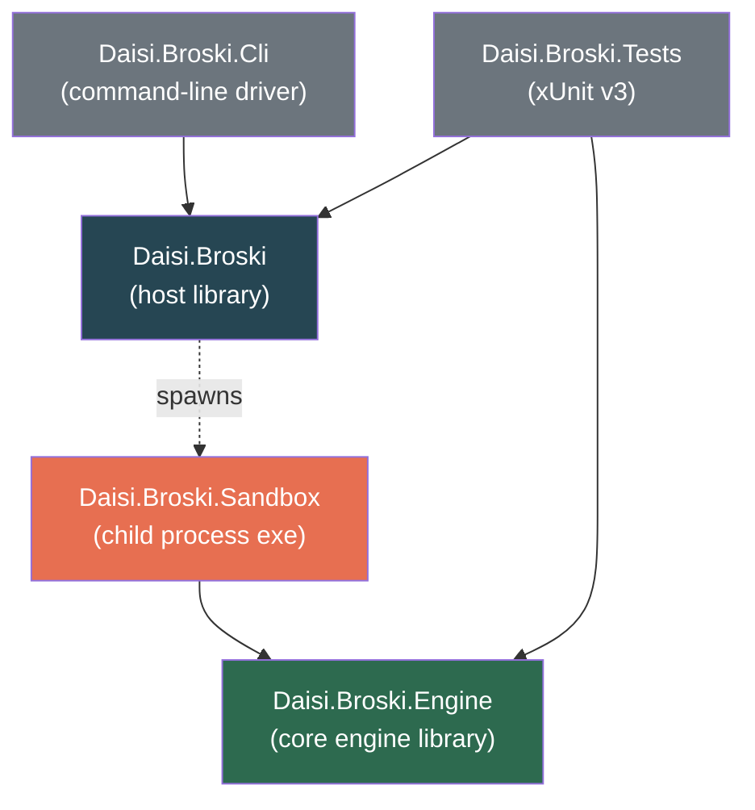

# Architecture

> System design for daisi-broski — a native C# headless web browser engine with no third-party dependencies.
> [Roadmap](roadmap.md)

---

## 1. Elevator pitch

daisi-broski is a browser engine implemented entirely in C# against the .NET 10 Base Class Library. It takes a URL, fetches it over HTTP/HTTPS, parses the HTML5 response into a DOM, parses stylesheets into a CSSOM, executes JavaScript against the DOM inside our own interpreter, and exposes the resulting state to a host application — all inside a sandboxed child process with kernel-enforced memory and resource limits.

We deliberately scope out visual rendering (layout, paint, fonts, compositing) in early phases. Most "browsing" tasks that embedders actually want — scraping, automation, testing, AI agents, preview generation — need a working DOM and a working JavaScript engine, not a pixel buffer. Adding layout later is a well-isolated additive phase; it does not change the core engine.

## 2. Constraints and what they imply

| Constraint | Implication |
|---|---|
| **Native C# only** | No C/C++ interop to V8, SpiderMonkey, or Blink. The JS engine, HTML parser, and CSS engine are all written in C#. |
| **No third-party libraries** | Parsers, interpreters, compression (beyond `System.IO.Compression`), and decoders are hand-written. `HttpClient`, `SslStream`, `System.Net.WebSockets`, `System.Text.Json`, `System.IO.Pipes`, `System.Security.Cryptography` are BCL and therefore allowed. |
| **Sandboxed memory space** | The engine runs in a *child process* bounded by a Win32 Job Object. The host process never executes untrusted parser, DOM, or JS code in its own address space. |
| **Works with most websites** | Target modern JS-heavy SPAs. The bar is "loads initial content and responds to scripted interaction," not pixel parity with Chromium. |
| **No external dependencies** | No downloads at build time, no native binaries (beyond what Windows already ships), no package feeds. `dotnet build` on a clean machine should produce a working binary. |

The "no third-party" rule is the hardest constraint because it rules out every existing HTML parser and JS engine in the .NET ecosystem. We are writing those.

## 3. Process model

```
┌─────────────────────────────┐           ┌─────────────────────────────┐
│ Host process                │           │ Sandbox child process        │
│  (Daisi.Broski.Cli, or any   │  named    │  (Daisi.Broski.Sandbox.exe)  │
│   consumer application)      │  pipe     │                              │
│                              │ ◄───────► │  ┌────────────────────────┐ │
│  Daisi.Broski.Host            │  IPC      │  │ Daisi.Broski.Engine    │ │
│  ┌────────────────────┐      │           │  │  - Network (HttpClient)│ │
│  │ BrowserSession     │      │           │  │  - HTML5 parser        │ │
│  │  - spawn()         │      │           │  │  - CSS parser          │ │
│  │  - navigate()      │      │           │  │  - DOM                 │ │
│  │  - evaluate()      │      │           │  │  - JS interpreter      │ │
│  │  - dispose()       │      │           │  │  - Web APIs            │ │
│  └────────────────────┘      │           │  └────────────────────────┘ │
│                              │           │                              │
│  Win32 Job Object ──────────────────────► enforces memory cap, kills    │
│  (kernel-enforced)           │           │  child on host exit, blocks  │
│                              │           │  UI, etc.                    │
└─────────────────────────────┘           └─────────────────────────────┘
```

**Why a separate process?** Three reasons:

1. **True memory isolation.** .NET's `AppDomain` is deprecated; `AssemblyLoadContext` provides assembly isolation but not a security boundary — unsafe code, P/Invoke, and unbounded allocations can still take down the host. Only an OS process boundary gives you kernel-enforced memory limits and crash containment.
2. **Resource caps.** Job Objects let us set a hard `ProcessMemoryLimit` (e.g. 256 MiB). If the JS engine runs away or a site tries to blow up the parser, the kernel kills the child — not our host.
3. **Kill-on-host-exit.** With `JOB_OBJECT_LIMIT_KILL_ON_JOB_CLOSE`, closing the host process automatically terminates every sandbox child. No stragglers, no leaks.

**Why one child per session (not per origin)?** Initial implementation: one child per `BrowserSession`. This keeps IPC simple and matches most use cases (one script = one tab). A per-origin process-per-site model is a later optimization; the IPC protocol and sandbox launcher already support it trivially by spawning multiple children.

## 4. Solution layout



| Project | Role |
|---|---|
| **Daisi.Broski** | The public host-side API: `BrowserSession`, `NavigationOptions`, result types. Responsible for spawning the sandbox child, setting up the Job Object, and running the IPC client over a named pipe. No parsing, no JS — pure host. |
| **Daisi.Broski.Engine** | The core engine library. Networking, HTML5 parser, CSSOM, DOM, JavaScript interpreter, Web APIs. Does not know about processes or IPC. Can be unit-tested directly in-process. |
| **Daisi.Broski.Sandbox** | A console `.exe` whose `Main` does three things: apply a restricted token if an AppContainer SID was passed, listen on an inherited pipe handle, and drive `Daisi.Broski.Engine` with the commands the host sends. Keeps the engine free of IPC concerns. |
| **Daisi.Broski.Cli** | A thin CLI that wraps `Daisi.Broski` for manual use: `daisi-broski fetch <url>`, `daisi-broski eval <url> <script>`, etc. |
| **Daisi.Broski.Tests** | xUnit v3 test project. Fast unit tests run against `Daisi.Broski.Engine` directly; integration tests drive the full sandboxed host API against a local test server and against a curated list of real sites. |

`Daisi.Broski.Engine` has no dependency on `Daisi.Broski` or `Daisi.Broski.Sandbox` — it's a pure library. This is what lets us test it in-process without any IPC.

## 5. Subsystem-by-subsystem

### 5.1 Networking

`Daisi.Broski.Engine.Net` is a thin facade over `HttpClient` with a custom `HttpMessageHandler` that adds:

- **Cookie jar** — per-session `CookieContainer`. Also handles `Set-Cookie` edge cases `CookieContainer` gets wrong (e.g. `SameSite=None` without `Secure`) via a small prefilter.
- **Redirect policy** — manual redirect handling so we can expose the full chain and cap the count.
- **Request interception** — every request flows through a pluggable `IRequestInterceptor` so the host can block, rewrite, or record traffic (useful for the sandbox's network allowlist, §5.8).
- **Decompression** — `HttpClient` handles gzip/deflate; Brotli is `BrotliStream` (BCL). Zstd is not yet standard in Web; skip.
- **HTTP/2** — `HttpClient` supports it natively on .NET 10. HTTP/3 is opt-in and we'll enable it when sites require it.
- **WebSockets** — `System.Net.WebSockets.ClientWebSocket`, wrapped into the DOM's `WebSocket` Web API.
- **DNS** — default `HttpClient` resolver, but we expose an `IDnsResolver` hook so the sandbox can enforce an allowlist without the engine even knowing about it.

No third-party HTTP client. No custom TLS. `SslStream` underneath is fine.

### 5.2 HTML5 parser

Fully spec-compliant HTML5 tokenizer and tree construction. This is the WHATWG algorithm: a big state machine for the tokenizer, a second state machine ("insertion mode") for tree construction, plus the infamous "adoption agency algorithm" for misnested tags.

**Design:**

- `Daisi.Broski.Engine.Html.Tokenizer` — struct-based state machine over `ReadOnlySpan<char>`, producing a stream of tokens (`StartTag`, `EndTag`, `Character`, `Comment`, `Doctype`, `EOF`).
- `Daisi.Broski.Engine.Html.TreeBuilder` — consumes tokens, maintains the open-element stack and active-formatting-elements list, and builds `DomNode`s.
- Error recovery is spec-mandated: the parser *cannot* fail on malformed input. It has to do exactly what every other browser does, or sites break.
- Input encoding detection: BOM sniff → `<meta charset>` prescan (first 1024 bytes) → `Content-Type` header → UTF-8 default.
- Document fragments, template elements, and foreign content (SVG/MathML) are minimally supported — enough that parsing doesn't derail when sites embed them.

**What we skip initially:** `<script>`-triggered document.write reentry (treat scripts as async), full SVG/MathML DOM (parse into a stub tree, ignore semantics), and pretty-printing on serialization.

**Test strategy:** run [html5lib-tests](https://github.com/html5lib/html5lib-tests) (we copy the `.dat` files into the repo; they're CC0 test vectors, not a library). Target: >95% pass rate on the `tokenizer/` and `tree-construction/` suites before calling the parser "done."

See [html-parser.md](html-parser.md) for the detailed design (planned).

### 5.3 CSS parser, selectors, cascade

We need enough CSS for JavaScript to query computed styles and for `querySelector(All)` to work. We do **not** need layout in phase 1.

**Components:**

- `Daisi.Broski.Engine.Css.Tokenizer` — CSS Syntax Level 3 tokenizer.
- `Daisi.Broski.Engine.Css.Parser` — produces a `Stylesheet` of `Rule`s, each a `Selector[]` and a `Declaration[]`.
- `Daisi.Broski.Engine.Css.Selectors` — compiled selector matcher supporting Selectors Level 4 (without the bits nobody uses, like `:has()` initially).
- `Daisi.Broski.Engine.Css.Cascade` — resolves computed values per element: specificity, `!important`, inheritance, `var()`, `calc()`, media queries.
- Style recalculation is triggered on DOM mutation with a dirty-node set.

This gives us enough for `element.style`, `getComputedStyle`, `matches()`, `closest()`, `querySelector`. Layout-dependent values (`getBoundingClientRect`, offsets, etc.) return stubs in phase 1 — see §8.

### 5.4 DOM

`Daisi.Broski.Engine.Dom` implements DOM Level 4 plus the parts of the HTML standard that JS code actually touches:

- `Node`, `Element`, `Text`, `Comment`, `Document`, `DocumentFragment`, `Attr`.
- `HTMLElement`, `HTMLInputElement`, `HTMLFormElement`, `HTMLImageElement`, ...the tag-specific interfaces sites reference via `instanceof`.
- Event targets, capture/bubble dispatch, `addEventListener`, `removeEventListener`, `dispatchEvent`.
- `NodeList`, `HTMLCollection` (live and static flavors).
- `MutationObserver` with a microtask-queued notification model.
- Shadow DOM — basic open shadow roots. Closed mode is rare enough to defer.

**Critical design call:** the DOM is *not* a JS object. It's a plain C# object graph. The JS engine exposes it via "host objects" — proxy-like wrappers that route property access and method calls back into the C# DOM. This means the DOM can be tested, serialized, and mutated without booting the JS engine, and the JS engine has no special knowledge of "this is an HTMLElement."

### 5.5 JavaScript engine — the hardest part

This is where the most engineering effort goes. We are not going to write a performance-competitive V8. We are going to write a **correctness-first, pragmatic-subset** JavaScript engine that runs the JS real sites actually ship.

**Architecture:**

```
Source text
  │
  ▼
Lexer ──► Token stream
             │
             ▼
          Parser ──► AST (ESTree-shaped)
                       │
                       ▼
                   Bytecode compiler ──► Bytecode (stack VM)
                                              │
                                              ▼
                                     Interpreter (stack machine)
                                              │
                                              ▼
                                        Heap + Realm + Built-ins
```

**Why a bytecode VM, not a tree-walking interpreter?**

A naïve tree-walker is maybe 100x slower than a real engine. Most sites tolerate that for a few hundred milliseconds of initial script, but runtime work (animation loops, React reconciliation, IntersectionObserver callbacks) starts to stall. A stack-based bytecode VM written in C# gets us maybe 10–30x slowdown vs V8 — acceptable for a headless agent, unacceptable for interactive UI, which we don't care about in phase 1.

The compiler is simple: post-order walk the AST emitting ops (`PushConst`, `LoadLocal`, `StoreGlobal`, `Call`, `Jump`, `JumpIfFalse`, `MakeFunction`, ...). The interpreter is a dispatch loop over `readonly Span<Op>`.

**Language scope:**

- **Phase 3a — ES5 core.** `var`/`function`, expressions, control flow, prototypes, closures, `this`, `arguments`, `try/catch`, regex (we *will* write our own NFA-based regex engine because `System.Text.RegularExpressions` differs from ECMA regex in several important ways), strict mode.
- **Phase 3b — ES2015 core.** `let`/`const`, block scoping, arrow functions, classes, template literals, destructuring, default parameters, rest/spread, `Symbol`, iterators, generators, modules (ESM), `Map`/`Set`/`WeakMap`/`WeakSet`, `Promise`, `for..of`.
- **Phase 3c — ES2017+ sugar.** `async`/`await` (desugared to promise chains and generators), `**`, `Object.values/entries`, `Array.prototype.includes`, optional chaining `?.`, nullish coalescing `??`, logical assignment, `BigInt` (basic), `Proxy` and `Reflect` (minimum viable).

**Built-ins:**

Every built-in the spec requires (Object, Function, Array, String, Number, Boolean, Symbol, Math, Date, RegExp, Error and friends, JSON, Map, Set, WeakMap, WeakSet, Promise, ArrayBuffer, typed arrays, DataView). This is a lot of code but it's all mechanical translation from the ECMAScript spec. Each built-in is its own file under `Engine/Js/Builtins/`.

**What we do NOT implement:**

- **JIT.** Interpreter only. Performance is good enough for headless use; a JIT adds a mountain of complexity and a whole new security surface.
- **Full `eval`.** Supported but runs through the same compiler — no sneaky fast paths.
- **Generators + async iterators interop corners.** We get the common cases right; edge cases throw.
- **Incremental GC.** We lean on .NET's GC. The JS heap is a graph of C# objects; .NET tracks references; objects with finalizable resources (file handles, etc.) are rare in pure script code. If this becomes a problem we add a mark-and-sweep pass over the JS heap later.

**Event loop:**

A single-threaded event loop matching the HTML spec:

1. Run task → run all pending microtasks (promises, MutationObserver callbacks) → render step (no-op in headless) → repeat.
2. Tasks include: script execution, resource-load callbacks, timer callbacks, DOM event dispatch.
3. `setTimeout`/`setInterval` post to the task queue; the loop drains the queue and waits on a `ManualResetEventSlim` when idle. `queueMicrotask` and promise continuations post to the microtask queue.
4. The loop runs on one dedicated thread in the sandbox child. `HttpClient` and other async I/O continuations are marshaled back onto it via a custom `SynchronizationContext`.

**Test strategy:** [test262](https://github.com/tc39/test262) — the official ECMAScript conformance suite. Vendored at a pinned commit. Initial target: >80% pass rate on the phase 3a feature set. Long-term: >95% on the features we claim to support.

See [js-engine.md](js-engine.md) for the detailed design (planned).

### 5.6 Web APIs (the bridge from JS to browser)

Web APIs live in `Daisi.Broski.Engine.WebApi`. Each API is a C# class that registers host functions into the JS realm. The engine knows nothing about fetch or DOM; they are wired up at realm construction time.

Day-one APIs:

- `window`, `self`, `globalThis` (alias to the realm global)
- `document` (the DOM tree)
- `console.{log,warn,error,info,debug,dir,table}` (routed to host over IPC)
- `setTimeout`, `setInterval`, `clearTimeout`, `clearInterval`, `queueMicrotask`
- `fetch`, `Request`, `Response`, `Headers`, `AbortController`, `AbortSignal`
- `XMLHttpRequest` (legacy but still used)
- `URL`, `URLSearchParams` (BCL `Uri` does most of this)
- `TextEncoder`, `TextDecoder` (UTF-8 BCL is fine)
- `atob`, `btoa` (`Convert.ToBase64String`)
- `crypto.getRandomValues`, `crypto.randomUUID`, `crypto.subtle` (`System.Security.Cryptography`)
- `localStorage`, `sessionStorage` (backed by a simple file store per origin, cleared on session dispose for sessionStorage)
- `IndexedDB` — stubbed with a "not supported" error that lets sites fall back. Real impl is phase 5.
- `Location`, `History`
- `navigator.userAgent` (configurable; default to a recent Chromium string to maximize site compatibility — many sites gate features on UA sniffing)
- `Performance.now`
- `requestAnimationFrame` — headless: fires at 60 Hz on a timer, or every microtask drain, or disabled. Configurable.
- `MutationObserver`, `IntersectionObserver` (stubbed, fires once with all elements intersecting), `ResizeObserver` (stubbed)
- `Event`, `CustomEvent`, `MessageEvent`, `ErrorEvent`, `EventTarget`
- `FormData`, `Blob`, `File`
- `WebSocket`

**User-agent strategy:** defaulting to a current Chromium UA is a deliberate choice. The alternative — announcing ourselves as "DaisiBroski/1.0" — causes a nontrivial fraction of real sites to serve degraded or blocked responses. The UA is overridable; users who care about honesty over compatibility can flip it.

### 5.7 Image decoders

Only needed when we reach layout/rendering (phase 6+). Until then, image requests complete, bytes are available to JS (e.g. for canvas or fetch), but no decoding happens.

When we do need them:

- **PNG** — writable from scratch in a few hundred lines. We need DEFLATE, which `System.IO.Compression.DeflateStream` provides.
- **JPEG** — baseline DCT is ~1500 lines, progressive is more. Doable from scratch.
- **GIF** — LZW decoder, a few hundred lines.
- **WebP/AVIF** — hard. Deferred to "maybe never" in phase 1. Sites that require WebP decoding will have broken images, not broken pages.

### 5.8 Sandboxing

This is the part the "sandboxed memory space" requirement is really about. The design:

```
Host process
  │
  │ 1. Create Job Object
  │    - JOBOBJECT_EXTENDED_LIMIT_INFORMATION
  │        .ProcessMemoryLimit = 256 MiB
  │        .LimitFlags |= JOB_OBJECT_LIMIT_PROCESS_MEMORY
  │        .LimitFlags |= JOB_OBJECT_LIMIT_KILL_ON_JOB_CLOSE
  │        .LimitFlags |= JOB_OBJECT_LIMIT_DIE_ON_UNHANDLED_EXCEPTION
  │    - JOBOBJECT_BASIC_UI_RESTRICTIONS
  │        block desktop, display settings, global atoms, handles
  │
  │ 2. Create an anonymous pipe pair (host-side RX, child-side TX + vice versa)
  │
  │ 3. Build STARTUPINFOEX with PROC_THREAD_ATTRIBUTE_HANDLE_LIST
  │    containing exactly the pipe handles (no handle inheritance leak)
  │
  │ 4. (Optional) Create AppContainer profile via CreateAppContainerProfile,
  │    build SECURITY_CAPABILITIES with no capabilities granted.
  │    This gets us integrity-level sandboxing: the child cannot open files
  │    outside AppContainer paths, cannot connect to loopback without the
  │    InternetClient capability, etc.
  │
  │ 5. CreateProcess(Daisi.Broski.Sandbox.exe, ..., CREATE_SUSPENDED |
  │    EXTENDED_STARTUPINFO_PRESENT, ..., &si.StartupInfo, &pi)
  │
  │ 6. AssignProcessToJobObject(job, pi.hProcess)
  │
  │ 7. ResumeThread(pi.hThread)
  │
  │ 8. Host now talks to child over the pipe. IPC is the only channel.
  ▼
Child process
  - Inherits pipe handles.
  - Drops any unneeded privileges (even though AppContainer already did most of it).
  - Enters message loop.
  - On crash or memory-limit hit: kernel kills it, host's pipe read returns EOF,
    host surfaces the error, spawns a fresh child if the session should continue.
```

**Why Job Objects + AppContainer, not `AppDomain`?**

`AppDomain` is gone in .NET Core+. `AssemblyLoadContext` doesn't stop unsafe code from corrupting memory, can't enforce a memory cap, and lives in the same process. Only an OS process boundary with a kernel-enforced job gives us: hard memory cap, guaranteed kill-on-close, crash containment, and optional filesystem/network sandboxing via AppContainer.

**Why not a Hyper-V container / Windows Sandbox?**

Too heavy. A Hyper-V container takes seconds to spin up and hundreds of MB of RAM. We want child-process startup in the tens of milliseconds and memory overhead under 20 MiB. Job Object + AppContainer hits that; WSL / HVCI does not.

**Cross-platform note.** The Job Object design is Windows-specific. On Linux we'd replace it with `unshare` + seccomp-bpf + cgroups v2 memory caps. On macOS, `sandbox_init` with a custom profile. Both are phase 5; Windows ships first.

See [sandbox.md](sandbox.md) for the detailed Win32 P/Invoke design (planned).

### 5.9 IPC protocol

Host ↔ sandbox communicates over a `NamedPipeClientStream` / `NamedPipeServerStream` pair (or an anonymous pipe pair, which is lighter and doesn't need namespacing).

**Wire format:** length-prefixed messages. The body is JSON serialized with `System.Text.Json`. No protobuf, no MessagePack, no third-party serializer — BCL JSON is fast enough and debuggable.

```
┌───────────┬────────────┬────────────────────────┐
│ u32 len   │ u16 msgId  │ UTF-8 JSON payload     │
└───────────┴────────────┴────────────────────────┘
```

**Messages (host → sandbox):**

- `Navigate { url, headers, referrer, timeoutMs }`
- `Evaluate { script, awaitPromise }`
- `EvaluateHandle { targetObjectId, script, awaitPromise }` — like Evaluate but against a specific DOM/JS object by id
- `SetCookie`, `ClearCookies`
- `SetUserAgent`, `SetViewport` (metadata only in headless)
- `DispatchEvent { targetObjectId, event }` — synthesize click, input, etc.
- `GetDocument` — returns serialized DOM snapshot (structured clone of the tree, nodes get opaque ids the host can refer to later)
- `Screenshot` — phase 6+, returns `null` until then
- `Close`

**Messages (sandbox → host):**

- `NavigationStarted`, `NavigationCompleted`, `NavigationFailed`
- `ConsoleMessage` — fan-out of `console.*`
- `RequestAboutToBeSent`, `ResponseReceived` — network telemetry
- `JsException` — unhandled rejection, script error
- `DialogOpened` — `alert`, `confirm`, `prompt` (defaults to auto-dismiss in headless)
- `Closed`

Structured-clone semantics for JS values crossing the boundary: primitives serialize directly, objects get opaque handle ids the host can refer back to without the engine needing to serialize the entire object graph. The handle table lives on the sandbox side and is cleared when the host disposes the session.

## 6. Threading model

The sandbox child has three logical threads:

1. **Engine thread** — runs the event loop, drives HTML parsing, CSS parsing, JS interpretation, DOM mutation. Everything script-facing happens here. This is single-threaded by design (same as every real browser's main thread).
2. **I/O pool** — `HttpClient` and `SslStream` continuations. Results are marshaled back onto the engine thread via a custom `SynchronizationContext` that posts to the event loop's task queue.
3. **IPC reader** — one thread blocked on the inbound pipe. When a message arrives, it posts a task onto the engine thread.

Outbound IPC (engine → host) can happen from the engine thread directly, since a single writer is fine; we don't need a dedicated IPC writer thread.

The host side has no threading constraints beyond "the pipe reader is a dedicated thread"; the public `BrowserSession` API is async and await-able.

## 7. Memory budget

Rough target: **256 MiB per sandbox child** including the CLR. That's tight — the CLR alone takes 40–60 MiB on a cold start — but workable for most pages.

Approximate split:

| Component | Budget |
|---|---|
| CLR + loaded assemblies | ~60 MiB |
| HTML/CSS parsers, DOM tree | ~30 MiB |
| JS heap (all user script objects, strings, closures) | ~100 MiB |
| Networking buffers, decompression scratch | ~20 MiB |
| Image bytes (un-decoded) | ~30 MiB |
| Headroom | ~16 MiB |

When the Job Object limit is hit, the kernel kills the child. The host sees EOF on the pipe, surfaces `SandboxMemoryExceeded`, and optionally respawns.

**AOT note:** compiling the sandbox child with `PublishAot` would cut startup time and working-set by a lot. It's a phase 6 optimization — AOT restricts reflection, which the JS built-ins liberally use today. We'll revisit after the JS engine stabilizes.

## 8. Explicit non-implementation stubs

To avoid scope creep, phase 1 ships stubs for several APIs that *must* exist (sites crash if they don't) but don't need real implementations to load most pages:

- `getComputedStyle` returns declared styles only; layout-dependent values (`width`, `height`, offsets) return `0px` or empty strings.
- `getBoundingClientRect`, `offsetWidth`, `offsetHeight` return zeros.
- `IntersectionObserver` fires once, reporting all observed targets as intersecting.
- `requestAnimationFrame` fires at a fixed simulated 60 Hz.
- `IndexedDB` throws `InvalidStateError` on `open()` — sites with feature detection fall back to `localStorage` or in-memory.
- `WebGL`, `WebGPU`, `Canvas2D` — `canvas.getContext()` returns `null` for any 2d/3d context. Sites that can't detect this will break. Phase 6+.
- `MediaStream`, `getUserMedia`, `RTCPeerConnection`, `Audio`, `Video` — not implemented. Sites that need them break.

These are explicit design choices, not bugs. The principle: **a missing API that throws cleanly is better than a half-implemented API that lies.** Many sites feature-detect; they'll adapt. The ones that don't are outside our "most websites" bar.

## 9. Security model

- **Same-origin policy** — enforced in the fetch/XHR paths. No cross-origin without CORS headers. The engine reads `Access-Control-Allow-Origin` et al. itself; we are not using the browser-process CORS cheat of trusting network-stack enforcement because we *are* the network stack.
- **Mixed content** — HTTPS pages cannot make HTTP subresource requests unless explicitly allowed.
- **Cookies** — `HttpOnly`, `Secure`, `SameSite=Strict/Lax/None` honored. `Secure` cookies never leave HTTPS.
- **Script isolation** — each `BrowserSession` is a separate realm. No sharing of globals across sessions.
- **Prototype pollution mitigations** — `Object.prototype` is frozen before user script runs if the host opts in. Most sites survive this; some don't. Opt-in for now.
- **Sandbox escape** — the only host-facing surface the sandbox child can touch is the IPC protocol. The host MUST treat every IPC message as untrusted input: length-check, type-check, never `eval` content, never decode into runtime-typed .NET objects without bounds. This is the boundary that matters.

## 10. Testing strategy

Unit tests (fast, in-process against `Daisi.Broski.Engine`):

- HTML parser: html5lib test vectors (vendored `.dat` files).
- CSS parser: CSS WG tests for syntax and selector matching.
- JS engine: test262 at a pinned revision, scoped to the features we claim to support.
- DOM: WPT (web-platform-tests) subset — DOM and HTML standard conformance.

Integration tests (spawn the full sandbox):

- Local HTTP test server (`HttpListener`, BCL) serves fixture pages that exercise navigation, fetch, script evaluation, cookie handling, event dispatch.
- A second tier of tests hits a curated list of real public URLs on every PR with reduced frequency. These can fail without blocking; they detect real-world regressions.

Fuzzing (phase 5+):

- `SharpFuzz`-style coverage-guided fuzzing against the HTML parser, CSS parser, JS parser, and IPC message decoder. The constraint is "use no third-party libraries in product code" — fuzzing harness in the test project can bend that rule if needed, but libFuzzer-style in-process fuzzing can be done with BCL alone given some effort.

## 11. Open questions

1. **Should we ship an NFA regex engine, or reuse `System.Text.RegularExpressions`?** BCL regex has different Unicode behavior and doesn't match ECMA-262 regex in several edge cases. Most sites' regexes are simple enough that BCL works; a site that relies on ECMA regex `\p{...}` semantics or lookbehind edge cases would break. Tentative: BCL regex with a compatibility wrapper that translates the common differences, escalate to a custom engine only when needed.
2. **How aggressive should we be about spoofing fingerprints?** Beyond User-Agent, sites fingerprint on `navigator.platform`, `window.screen`, Canvas API output, WebGL vendor strings, etc. We can supply deterministic fake values, but this crosses into evasion territory. Default: report honestly where possible, supply plausible defaults only for the APIs every site checks.
3. **HTTP/3?** `HttpClient` supports it in .NET 10 but it's not default-on. Some sites negotiate HTTP/3 only. Enable behind a flag initially, make default later.
4. **Process-per-session vs process-per-origin?** Start with per-session (simpler). If we grow multi-tab use cases, the sandbox launcher already supports per-origin — it's just "spawn more children, route navigations by origin."
5. **GC strategy for the JS heap.** Currently we lean on .NET's GC, treating JS objects as regular C# references. This is fast and correct but means every JS object pays the C# object header (~16 bytes on 64-bit). For sites with millions of small JS objects (think: graph libraries, big JSON payloads), this is significant overhead. A pooled/arena allocator for short-lived JS values is a phase 6+ optimization.

## 12. What a minimum-viable phase-1 success looks like

"Load news.ycombinator.com, run its scripts without errors, and return a DOM snapshot whose `document.querySelectorAll('.storylink').length` matches what Chrome sees." That one demo exercises networking, HTML parsing, CSS selector matching, DOM construction, JS execution, Web API host functions, and IPC — every subsystem touched.

From there, the bar climbs: static marketing sites → docs sites → React/Vue SPAs → sites with heavy analytics → sites with anti-bot challenges. Each level teaches us which subsystem needs the most work next.
